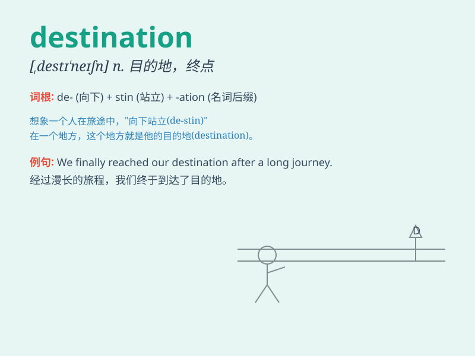

## destination

**英音:** _[,destɪ\'neɪʃ(ə)n]_ **美音:**
_[,dɛstɪ\'neʃən]_

**译义:** *n.目的地,[计] 目的文件,目的单元格*

### 短语

+ **final destination:** _最终目的地_

+ **destination port:** _目的港_

+ **destination country:** _目的国_

+ **tourist destination:** _旅游目的地_

+ **destination address:** _目的地址_

### 例句

#### 例句1

> **The destination of our trip is a beautiful beach.**

**中文翻译:** 我们旅行的目的地是一个美丽的海滩。

**单词释义:** 目的地

#### 例句2

> **She finally reached her destination after a long journey.**

**中文翻译:** 经过长途跋涉，她终于到达了目的地。

**单词释义:** 目的地

#### 例句3

> **What is your destination for this weekend?**

**中文翻译:** 这个周末你的目的地是哪里？

**单词释义:** 目的地

### 背诵小故事

> A brave explorer set off on a long journey. Through many
difficulties, he never gave up. His destination was a hidden treasure
island. Finally, he reached it and found great wealth.

**一位勇敢的探险家踏上了漫长的旅程。历经重重困难，他从未放弃。他的目的地是一座隐藏的宝藏岛。最终，他到达了那里并找到了巨大的财富。**

### 图义

