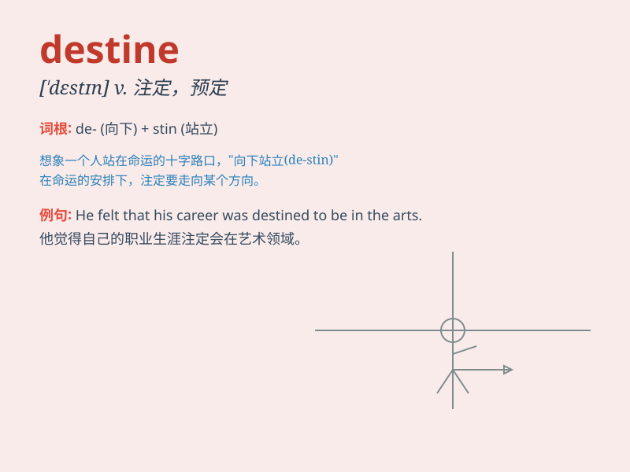

## destine

**英音:** _[\'destɪn]_ **美音:** _[\'dɛstɪn]_

**译义:** *vt.注定,预定*

### 短语

+ **be destine for:** _注定要去；注定成为_

+ **destine to do:** _注定要做_

+ **destine someone/something to:** _使某人/某物注定\...\..._

+ **destine by fate:** _由命运注定_

+ **destine from birth:** _生来注定_

### 例句

#### 例句1

> **She was destined to become a great musician.**

**中文翻译:** 她注定要成为一名伟大的音乐家。

**单词释义:** 注定

#### 例句2

> **This project is destined for success.**

**中文翻译:** 这个项目注定会成功。

**单词释义:** 注定

#### 例句3

> **Fate has destined them to meet again.**

**中文翻译:** 命运注定他们会再次相遇。

**单词释义:** 注定

### 背诵小故事

> A young adventurer was always told he was destine for greatness. One
day, he found a magical map that led him to a hidden treasure, proving
that his destiny was indeed special.

**一位年轻的冒险家总是被告知他注定会成就伟大。有一天，他找到了一张神奇的地图，引领他找到了隐藏的宝藏，证明了他的命运确实与众不同。**

### 图义

