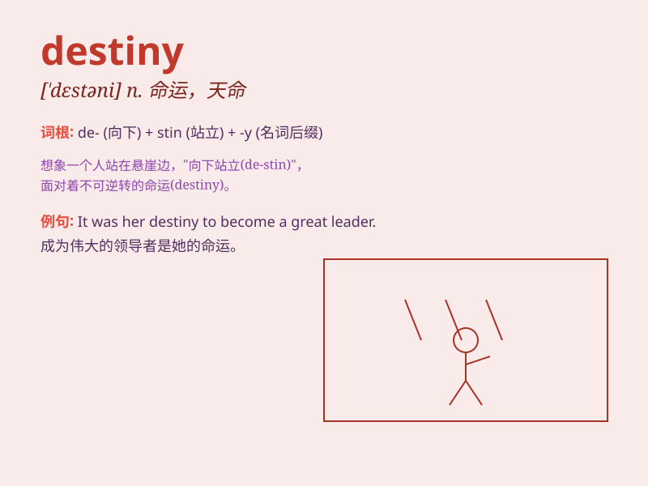

## destiny

**英音:** _[\'destɪnɪ]_ **美音:** _[\'dɛstəni]_

**译义:** *n.命运,定数*

### 短语

+ **meet one\'s destiny:** _面临某人的命运_

+ **fulfill one\'s destiny:** _完成某人的使命；实现某人的命运_

+ **shape one\'s destiny:** _塑造某人的命运_

+ **seal one\'s destiny:** _决定某人的命运_

+ **destiny awaits:** _命运在等待_

### 例句

#### 例句1

> **It is our destiny to build a better world.**

**中文翻译:** 建设一个更美好的世界是我们的命运。

**单词释义:** 命运

#### 例句2

> **She believes that destiny will lead her to the right person.**

**中文翻译:** 她相信命运会引导她遇到对的人。

**单词释义:** 命运

#### 例句3

> **He tried to fight against his destiny, but failed in the end.**

**中文翻译:** 他试图与命运作斗争，但最终失败了。

**单词释义:** 命运

### 背诵小故事

> A brave knight was constantly searching for his destiny. One day, he
found a magical sword that led him to a hidden castle. There, he
realized his destiny was to protect the kingdom. The knight\'s journey
shows that destiny is a path waiting to be discovered.

**一位勇敢的骑士一直在寻找他的命运。有一天，他找到了一把神奇的剑，这把剑将他引向了一座隐藏的城堡。在那里，他意识到他的命运是保护王国。这个骑士的旅程表明命运是一条等待被发现的道路。**

### 图义

