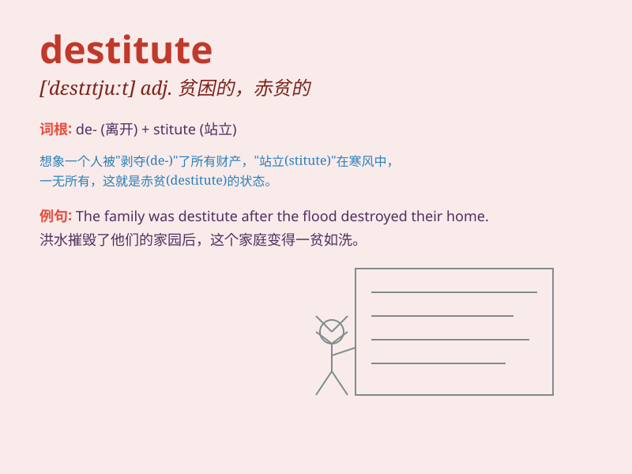

## destitute

**英音:** _[\'destɪtjuːt]_ **美音:** _[\'dɛstə\'tʊt]_

**译义:** *adj.困穷的,缺乏的*

### 短语

+ **be destitute of:** _缺乏；没有_

+ **destitute area:** _贫困地区_

+ **destitute family:** _贫困家庭_

+ **destitute person:** _贫困的人_

+ **fall destitute:** _变得贫困_

### 例句

#### 例句1

> **The old man was destitute and had to rely on charity to
survive.**

**中文翻译:** 老人家一贫如洗，只能靠施舍度日。

**单词释义:** 贫困的；贫穷的

#### 例句2

> **The region was left destitute after the natural disaster.**

**中文翻译:** 自然灾害发生后，该地区陷入贫困。

**单词释义:** 一无所有的；匮乏的

#### 例句3

> **He was morally destitute and had no sense of right and wrong.**

**中文翻译:** 他道德沦丧，没有是非观念。

**单词释义:** 缺乏（某种品质）的

### 背诵小故事

> A poor man was wandering in the street, looking destitute. He had no
money, no home, and no food. People passed by, but no one helped him.
Finally, a kind-hearted lady gave him some bread. \'Destitute\' means
having no money or resources, being very poor.

**一个穷人在街上徘徊，看起来一贫如洗。他没钱，没家，也没食物。人们路过，但没人帮他。最后，一位好心的女士给了他一些面包。'destitute'意思是没有钱或资源，极度贫困。**

### 图义

