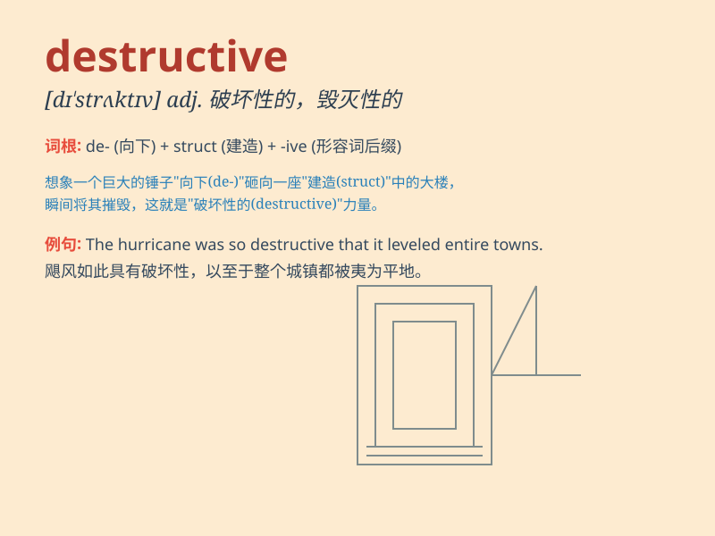

## destructive

**英音:** _[dɪ\'strʌktɪv]_ **美音:** _[dɪ\'strʌktɪv]_

**译义:** *adj.破坏(性)的*

### 短语

+ **destructive power:** _破坏力_

+ **destructive behavior:** _破坏性行为_

+ **destructive force:** _破坏力；破坏力量_

+ **destructive effect:** _破坏效果_

+ **destructive tendency:** _破坏倾向_

### 例句

#### 例句1

> **The earthquake was a destructive force that leveled many
buildings.**

**中文翻译:** 地震的破坏力很大，许多建筑物被夷为平地。

**单词释义:** 破坏性的

#### 例句2

> **His destructive behavior caused a lot of problems in the
team.**

**中文翻译:** 他的破坏性行为给球队带来了很多问题。

**单词释义:** 破坏的

#### 例句3

> **The storm brought destructive winds and heavy rain.**

**中文翻译:** 暴风雨带来了破坏性的大风和大雨。

**单词释义:** 破坏性的

### 背诵小故事

> A wildfire was spreading rapidly, destroying everything in its path.
The fire was so destructive that it left the forest in ruins. People
realized the power of this destructive force and vowed to prevent such
disasters in the future.

**一场野火迅速蔓延，摧毁了沿途的一切。这场火极具破坏性，让森林变成一片废墟。人们意识到这种破坏力量的强大，并发誓未来要预防此类灾害。**

### 图义

