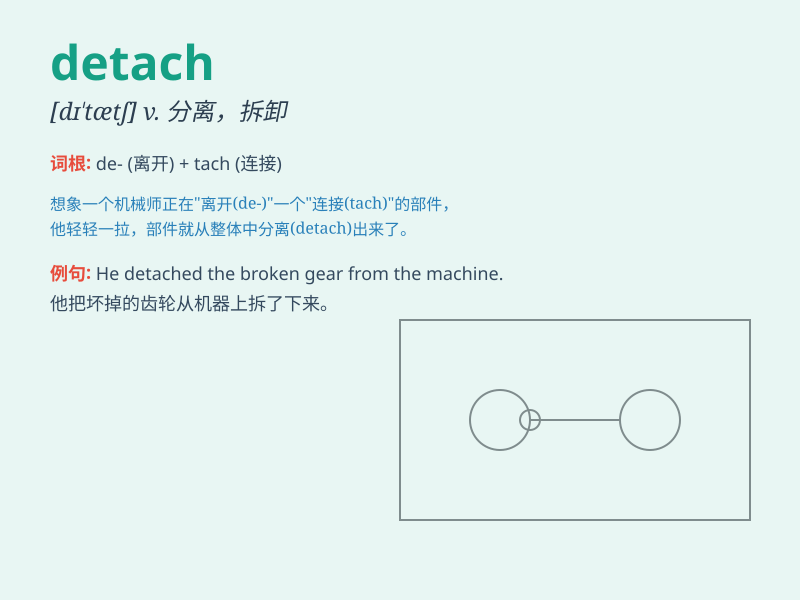

## detach

**英音:** _[dɪ\'tætʃ]_ **美音:** _[dɪ\'tætʃ]_

**译义:** *vt.分开,分离,分遣,派遣(军队)*

### 短语

+ **detach from:** _脱离；与......分开_

+ **detach oneself:** _使自己摆脱；使自己分离_

+ **detach mentally:** _精神上分离_

+ **detach emotionally:** _情感上脱离_

+ **detach temporarily:** _暂时分离_

### 例句

#### 例句1

> **He detached the trailer from the car.**

**中文翻译:** 他把拖车从汽车上拆下来。

**单词释义:** 分离，拆卸

#### 例句2

> **It\'s important to detach yourself from work and relax
sometimes.**

**中文翻译:** 有时让自己从工作中抽离出来放松一下很重要。

**单词释义:** 使脱离，使摆脱

#### 例句3

> **The doctor detached the retina to repair it.**

**中文翻译:** 医生将视网膜分离并进行修复。

**单词释义:** 分开，分离

### 背诵小故事

> A soldier was on a dangerous mission. To complete it, he had to
detach a key part from a machine. It was a tough task, but he did it.
Now you know \'detach\' means to separate or disengage something.

**一名士兵在执行一项危险的任务。为了完成它，他必须从一台机器上分离一个关键部件。这是一项艰巨的任务，但他做到了。现在你知道'detach'意思是分离、拆开某物。**

### 图义

