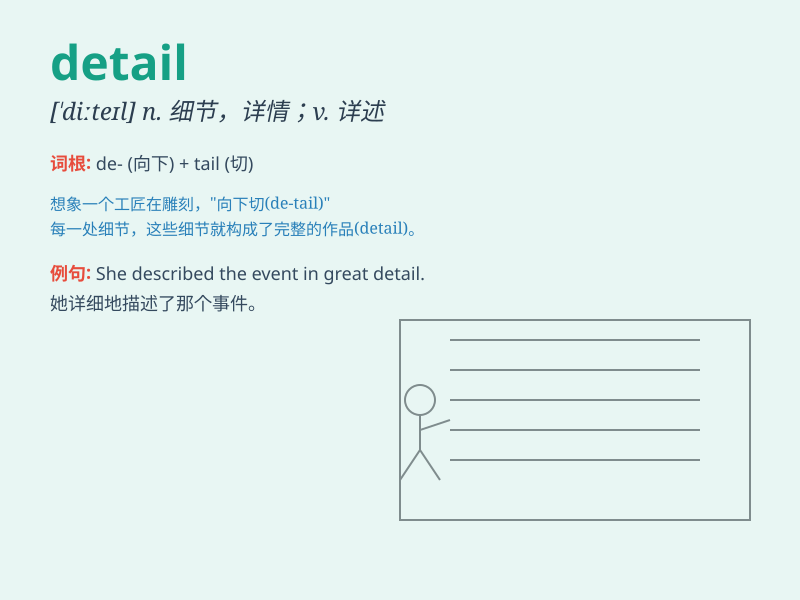

## detail

**英音:** _[\'diːteɪl]_ **美音:** _[dɪˈtel]_

**译义:** *n.细节,详情vt.详述,细说*

### 短语

+ **in detail:** _详细地_

+ **detail design:** _详细设计_

+ **go into detail:** _详述；详细叙述_

+ **detail list:** _详细清单_

+ **detail drawing:** _详图；明细图_

### 例句

#### 例句1

> **The report goes into detail about the company\'s financial
situation.**

**中文翻译:** 这份报告详细阐述了公司的财务状况。

**单词释义:** 详细情况；细节

#### 例句2

> **Please provide more details of your plan.**

**中文翻译:** 请提供你的计划的更多细节。

**单词释义:** 细节；详情

#### 例句3

> **She described the event in great detail.**

**中文翻译:** 她非常详细地描述了那个事件。

**单词释义:** 详细；详尽

### 背诵小故事

> A detective was solving a mystery. To crack the case, he needed to
pay attention to every detail. From the smallest mark to the slightest
sound, no detail was overlooked. Finally, he caught the criminal.

**一位侦探正在解决一个谜团。为了破案，他需要关注每一个细节。从最小的痕迹到最轻微的声音，任何细节都没有被忽略。最终，他抓住了罪犯。**

### 图义

