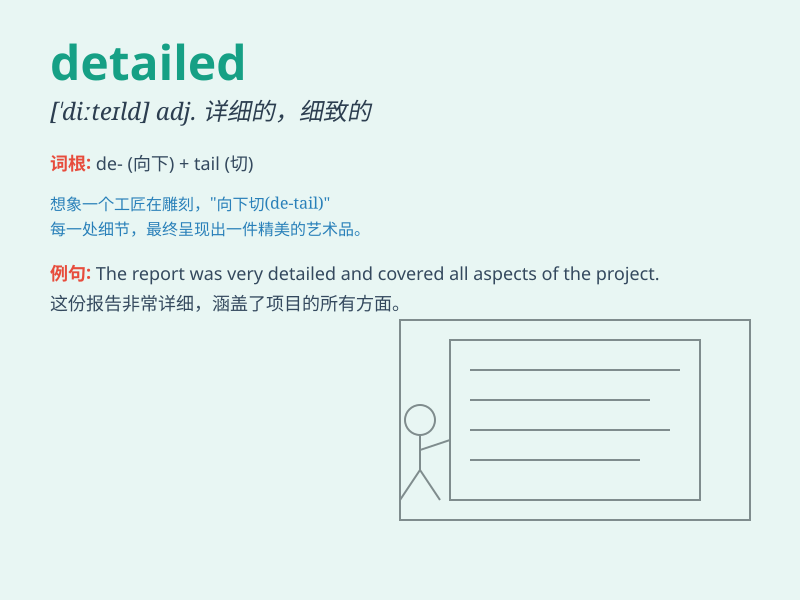

## detailed

**英音:** _[\'diːteɪld]_ **美音:** _[dɪ\'teld]_

**译义:** *adj.详细的,逐条的*

### 短语

+ **detailed description:** _详细的描述_

+ **detailed plan:** _详细的计划_

+ **detailed report:** _详细的报告_

+ **detailed analysis:** _详细的分析_

+ **detailed information:** _详细的信息_

### 例句

#### 例句1

> **The report provides a detailed analysis of the market trends.**

**中文翻译:** 这份报告提供了对市场趋势的详细分析。

**单词释义:** 详细的

#### 例句2

> **She gave a detailed description of the event.**

**中文翻译:** 她对该事件进行了详细的描述。

**单词释义:** 详细的

#### 例句3

> **The architect presented a detailed plan for the new building.**

**中文翻译:** 建筑师为新大楼提交了一份详细的计划。

**单词释义:** 详细的

### 背诵小故事

> A detective was working on a case. He needed to make a detailed
report. Every clue, every person\'s statement was noted precisely. With
such detailed work, he finally solved the mystery.

**一位侦探正在处理一个案子。他需要做一份详细的报告。每一条线索，每一个人的陈述都被准确地记录下来。凭借如此详尽的工作，他最终解开了谜团。**

### 图义

