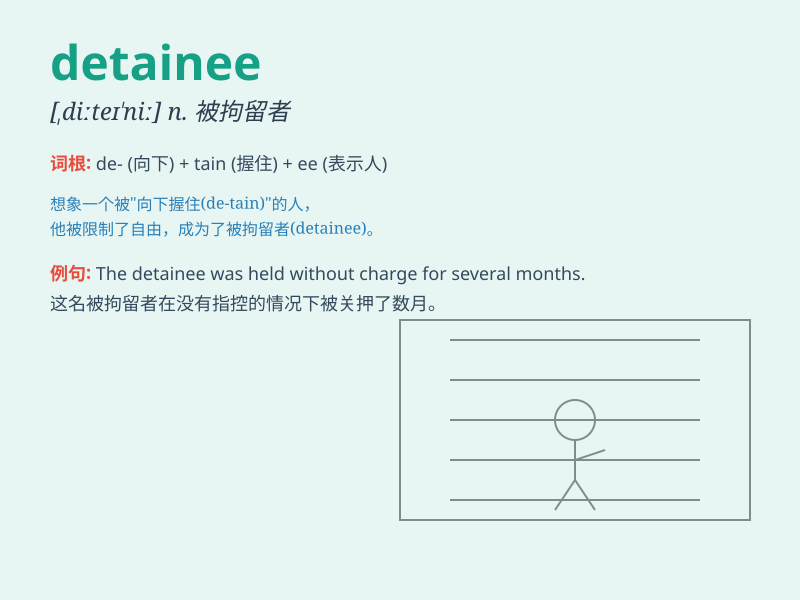

## detainee

**英音:** _[,dɪteɪ\'niː; ,diː-]_ **美音:**
_[\'dite\'ni]_

**译义:** *n.被拘留者,未判决囚犯*

### 短语

+ **political detainee:** _政治被拘留者_

+ **refugee detainee:** _难民被拘留者_

+ **illegal detainee:** _非法被拘留者_

+ **criminal detainee:** _刑事被拘留者_

+ **asylum seeker detainee:** _寻求庇护者被拘留者_

### 例句

#### 例句1

> **The detainee was held in a small cell without proper
facilities.**

**中文翻译:** 这名被拘留者被关在一个没有适当设施的小牢房里。

**单词释义:** 被拘留者

#### 例句2

> **The rights of the detainee must be respected.**

**中文翻译:** 被拘留者的权利必须得到尊重。

**单词释义:** 被拘留者

#### 例句3

> **The lawyer met with the detainee to discuss the case.**

**中文翻译:** 律师会见了被拘留者以讨论这个案子。

**单词释义:** 被拘留者

### 背诵小故事

> A man was wrongly accused and became a detainee. He was held in a
small room, feeling helpless and longing for justice. But finally, the
truth came out and he was set free. Remember, a detainee is someone who
is detained or held.

**一个男人被冤枉并成为了被拘留者。他被关在一个小房间里，感到无助并渴望正义。但最终，真相大白，他被释放了。记住，detainee
就是被拘留或扣押的人。**

### 图义

