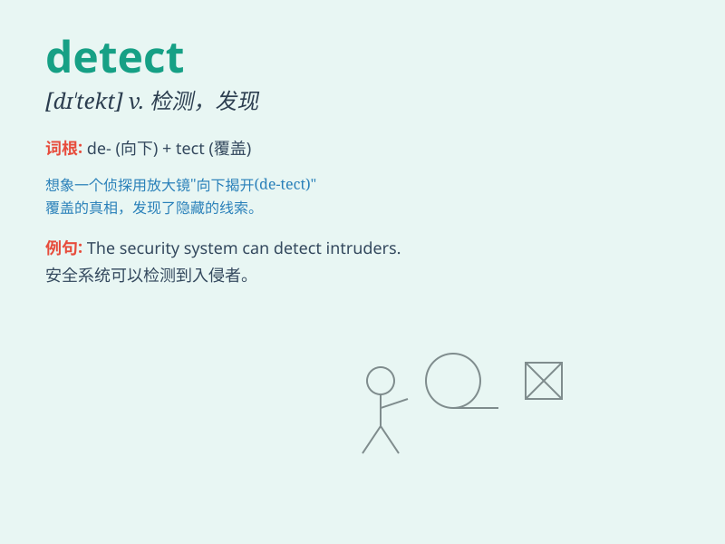

## detect

**英音:** _[dɪ\'tekt]_ **美音:** _[dɪ\'tɛkt]_

**译义:** *vt.察觉,发觉,侦查,探测v.发现*

### 短语

+ **detect fraud:** _察觉欺诈_

+ **detect error:** _发现错误_

+ **detect disease:** _诊断疾病_

+ **detect signal:** _探测信号_

+ **detect smell:** _察觉气味_

### 例句

#### 例句1

> **The doctor was able to detect the early signs of cancer.**

**中文翻译:** 医生能够察觉癌症的早期迹象。

**单词释义:** 察觉，发现

#### 例句2

> **The new radar system can detect aircraft at a great distance.**

**中文翻译:** 新的雷达系统能够在很远的距离探测到飞机。

**单词释义:** 探测，检测

#### 例句3

> **She has a sharp nose to detect the slightest smell of smoke.**

**中文翻译:** 她的鼻子很灵敏，能察觉最轻微的烟味。

**单词释义:** 察觉，发觉

### 背诵小故事

> A detective was on a mission to detect the thief. He used all his
skills and tools, carefully observing every clue. Finally, he succeeded
in detecting the criminal\'s hiding place.

**一位侦探肩负着侦查小偷的任务。他运用所有的技能和工具，仔细观察每一条线索。最终，他成功地侦查出罪犯的藏身之处。**

### 图义

