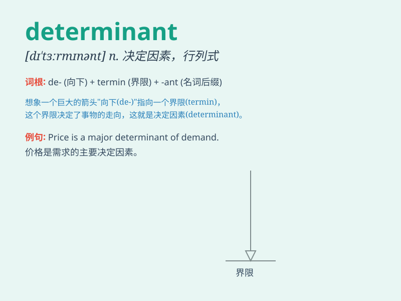

## determinant

**英音:** _[dɪ\'tɜːmɪnənt]_ **美音:** _[dɪ\'tɝmɪnənt]_

**译义:** *adj.决定性的*

### 短语

+ **principal determinant:** _主行列式_

+ **minor determinant:** _子行列式_

+ **determinant factor:** _决定因素_

+ **matrix determinant:** _矩阵行列式_

+ **cofactor determinant:** _余因子行列式_

### 例句

#### 例句1

> **The quality of the product is a determinant factor in its
success.**

**中文翻译:** 产品的质量是其成功的一个决定性因素。

**单词释义:** 决定性的；起决定作用的

#### 例句2

> **Genetics can be a determinant of certain diseases.**

**中文翻译:** 遗传可能是某些疾病的决定因素。

**单词释义:** 决定因素

#### 例句3

> **The determinant of the matrix is crucial for solving the
equation.**

**中文翻译:** 矩阵的行列式对于解方程至关重要。

**单词释义:** 行列式（数学术语）

### 背诵小故事

> A brave detective was trying to solve a mystery. The key determinant
was a hidden diary. Without it, the case couldn\'t be cracked. Finally,
the detective found the diary and solved the mystery.

**一位勇敢的侦探正在努力解开一个谜团。关键的决定因素是一本隐藏的日记。没有它，这个案子就无法侦破。最后，侦探找到了日记并破了案。**

### 图义

