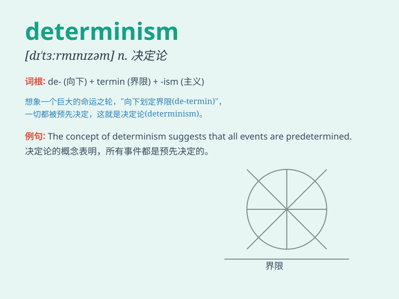

## determinism

**英音:** _[dɪ\'tɜːmɪnɪz(ə)m]_ **美音:**
_[dɪ\'tɝmɪnɪzəm]_

**译义:** *n.决定论*

### 短语

+ **Hard determinism:** _刚性决定论_

+ **Soft determinism:** _温和决定论_

+ **Biological determinism:** _生物决定论_

+ **Psychological determinism:** _心理决定论_

+ **Cultural determinism:** _文化决定论_

### 例句

#### 例句1

> **The theory of determinism holds that every event is caused by
previous events.**

**中文翻译:** 决定论认为每个事件都是由之前的事件引起的。

**单词释义:** 决定论

#### 例句2

> **He rejected determinism and believed in free will.**

**中文翻译:** 他拒绝决定论，并相信自由意志。

**单词释义:** 决定论

#### 例句3

> **The debate between determinism and indeterminism has lasted for
centuries.**

**中文翻译:** 决定论和非决定论之间的争论已经持续了几个世纪。

**单词释义:** 决定论

### 背诵小故事

> A brave adventurer was lost in a mysterious forest. Every choice he
made seemed determined by unseen forces. This situation perfectly
illustrated determinism, the belief that everything is caused by
previous events and conditions.

**一位勇敢的冒险家在神秘森林中迷路。他所做的每个选择似乎都由看不见的力量所决定。这种情况完美地诠释了决定论，即认为一切都是由先前的事件和条件所引起的。**

### 图义

