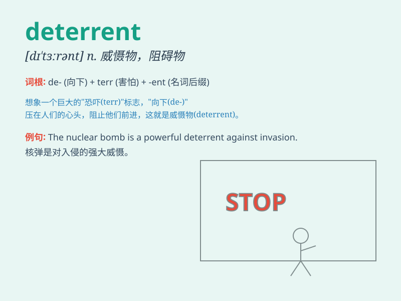

## deterrent

**英音:** _[dɪ\'ter(ə)nt]_ **美音:** _[dɪ\'tɝənt]_

**译义:** *n.威慑*

### 短语

+ **nuclear deterrent:** _核威慑_

+ **crime deterrent:** _犯罪威慑手段_

+ **deterrent effect:** _威慑作用；遏制效果_

+ **deterrent measure:** _威慑措施_

+ **deterrent power:** _威慑力量_

### 例句

#### 例句1

> **The high cost of the new law is a deterrent to many small
businesses.**

**中文翻译:** 新法律的高昂成本对许多小企业来说是一种阻碍。

**单词释义:** 阻碍因素；威慑物

#### 例句2

> **Capital punishment is supposed to be a deterrent to crime.**

**中文翻译:** 死刑应该是对犯罪的一种威慑。

**单词释义:** 威慑；遏制

#### 例句3

> **The presence of security guards is a deterrent against theft.**

**中文翻译:** 保安的存在对盗窃行为起到了遏制作用。

**单词释义:** 遏制力；威慑力量

### 背诵小故事

> In a small town, crime was on the rise. So, the police installed
high-tech cameras as a deterrent. Whenever someone thought of committing
a crime, they were scared by the thought of being caught on camera.
Thus, the cameras acted as a deterrent to prevent crimes.

**在一个小镇，犯罪率不断上升。于是，警方安装了高科技摄像头作为威慑手段。每当有人想犯罪时，一想到会被摄像头拍到就害怕。因此，这些摄像头起到了威慑作用，预防了犯罪。**

### 图义

