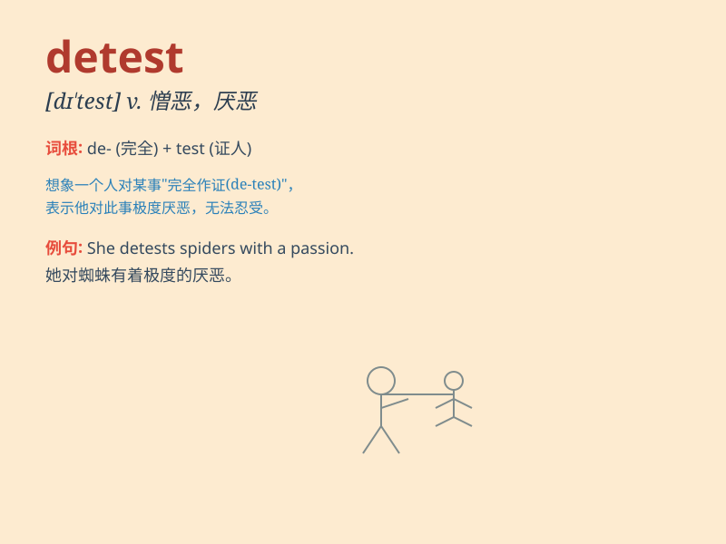

## detest

**英音:** _[dɪ\'test]_ **美音:** _[dɪ\'tɛst]_

**译义:** *vt.厌恶,憎恨*

### 短语

+ **detest doing sth:** _讨厌做某事_

+ **detest someone/something with a passion:**
_极其厌恶某人/某事_

+ **detest thoroughly:** _深恶痛绝_

+ **detest bitterly:** _痛恨_

+ **detest intensely:** _强烈憎恶_

### 例句

#### 例句1

> **I detest people who are cruel to animals.**

**中文翻译:** 我憎恶那些对动物残忍的人。

**单词释义:** 憎恶

#### 例句2

> **She detests doing housework.**

**中文翻译:** 她讨厌做家务。

**单词释义:** 讨厌

#### 例句3

> **He detested the way she always criticized him.**

**中文翻译:** 他讨厌她总是批评他的方式。

**单词释义:** 讨厌

### 背诵小故事

> Once upon a time, there was a mean witch. Everyone detested her
because she was always doing bad things to hurt others. Her evil deeds
made people feel disgusted and hate her deeply.

**从前，有一个邪恶的女巫。每个人都厌恶她，因为她总是做坏事伤害别人。她的恶行让人们感到反感和深深的憎恨。**

### 图义

