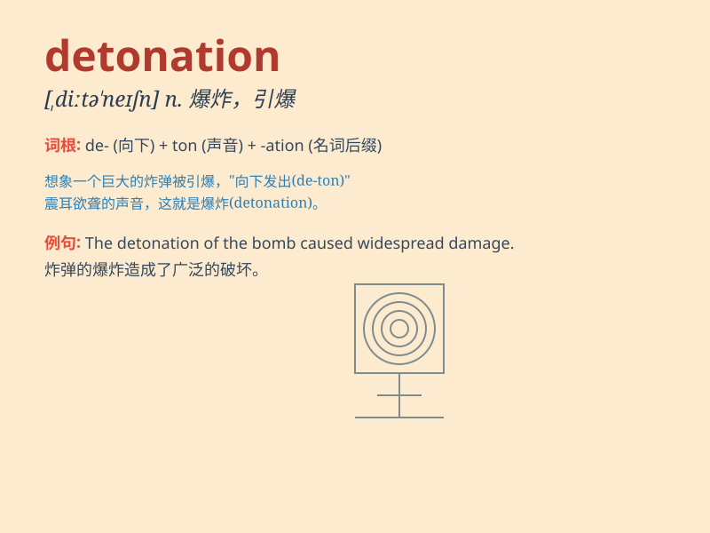

## detonation

**英音:** _[detə\'neɪʃ(ə)n]_ **美音:** _[,dɛtə\'neʃən]_

**译义:** *n.爆炸,爆炸声,爆裂*

### 短语

+ **nuclear detonation:** _核爆炸_

+ **controlled detonation:** _控制爆破_

+ **detonation wave:** _爆震波_

+ **detonation velocity:** _爆速_

+ **detonation pressure:** _爆压_

### 例句

#### 例句1

> **The detonation of the bomb caused widespread destruction.**

**中文翻译:** 炸弹的爆炸造成了大面积的破坏。

**单词释义:** 爆炸

#### 例句2

> **The scientists were studying the detonation process of the new
explosive.**

**中文翻译:** 科学家们正在研究这种新型炸药的爆炸过程。

**单词释义:** 爆炸

#### 例句3

> **A sudden detonation echoed through the valley.**

**中文翻译:** 一声突然的爆炸在山谷中回荡。

**单词释义:** 爆炸

### 背诵小故事

> A scientist was conducting an experiment. Suddenly, there was a huge
detonation. The shockwave shattered the glass and sent objects flying.
It was a terrifying moment, but it helped him understand the power of
the substance.

**一位科学家正在进行实验。突然，发生了一次巨大的爆炸。冲击波震碎了玻璃，把物品都炸飞了。这是一个可怕的时刻，但这帮助他了解了这种物质的威力。**

### 图义

