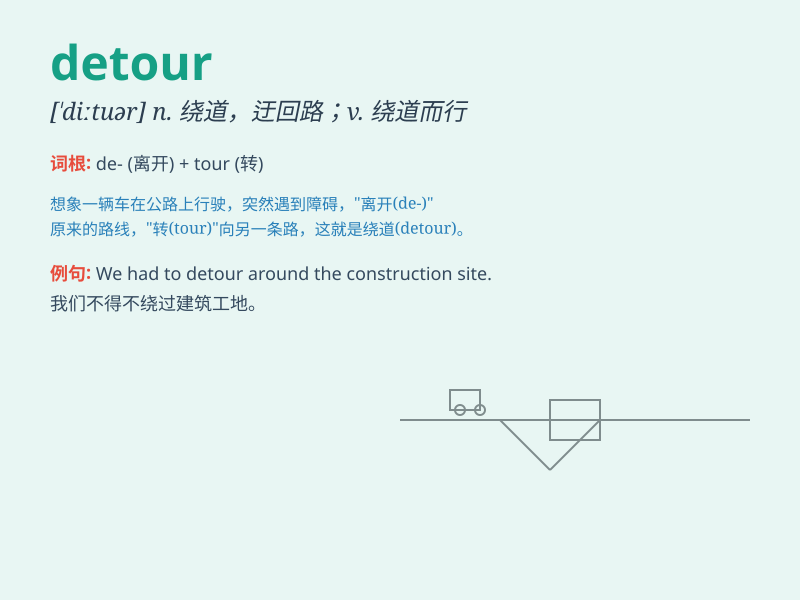

## detour

**英音:** _[\'diːtʊə]_ **美音:** _[\'ditʊr]_

**译义:** *n.便道,绕路vi.绕路而行vt.使绕道*

### 短语

+ **make a detour:** _绕道；迂回_

+ **take a detour:** _走弯路；绕路_

+ **detour road:** _迂回道路；绕行道路_

+ **detour sign:** _绕行标志_

+ **forced detour:** _被迫绕行_

### 例句

#### 例句1

> **We had to take a detour because the main road was closed.**

**中文翻译:** 因为主路关闭了，我们不得不绕道而行。

**单词释义:** 绕道；迂回

#### 例句2

> **The construction work forced us to make a detour through the side
streets.**

**中文翻译:** 施工工作迫使我们从小街绕道。

**单词释义:** 绕道；迂回的路线

#### 例句3

> **They took a long detour to avoid the traffic jam.**

**中文翻译:** 他们为了避开交通堵塞，绕了很长的路。

**单词释义:** 绕道；迂回的行程

### 背诵小故事

> One day, I was driving on a road. Suddenly, I saw a sign that said
\'Detour\'. I had to take a different route to reach my destination. It
was a long and unexpected detour, but I finally got there.

**有一天，我在路上开车。突然，我看到一个写着'绕路'的标志。我不得不走另一条路线到达目的地。这是一次漫长又意外的绕路，但我最终还是到了。**

### 图义

