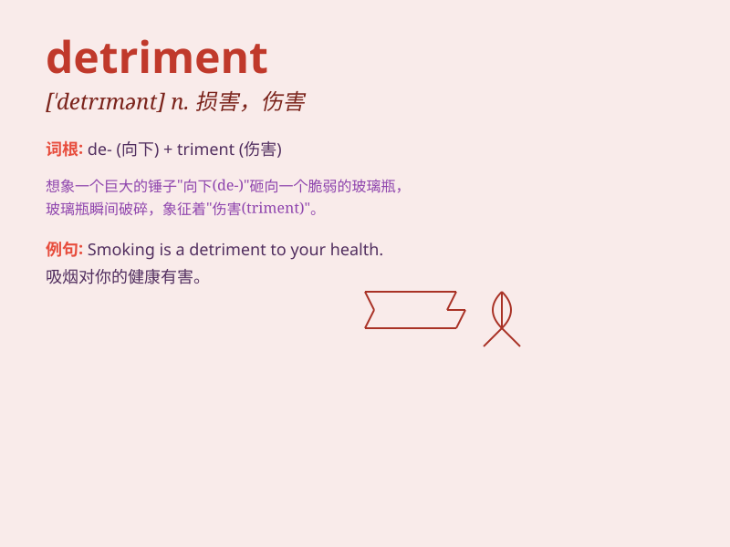

## detriment

**英音:** _[\'detrɪm(ə)nt]_ **美音:** _[\'dɛtrɪmənt]_

**译义:** *n.损害,损害物*

### 短语

+ **to the detriment of:** _有损于；对......不利_

+ **without detriment to:** _不损害；不影响_

+ **suffer detriment:** _遭受损害_

+ **cause detriment:** _造成损害_

+ **be in detriment:** _处于不利地位_

### 例句

#### 例句1

> **Smoking is to your detriment.**

**中文翻译:** 吸烟对你有害。

**单词释义:** 损害；伤害

#### 例句2

> **The new policy may work to the detriment of small businesses.**

**中文翻译:** 新政策可能对小企业不利。

**单词释义:** 不利；损害

#### 例句3

> **He was engrossed in his work to the detriment of his health.**

**中文翻译:** 他全神贯注于工作，损害了健康。

**单词释义:** 损害；伤害

### 背诵小故事

>
想象一个国王，他总是沉迷于奢华的宴会（feast），忽略了国家事务。这种行为对国家造成了损害（detriment），人民生活变得困苦。国王最终意识到自己的错误，但损害已无法挽回。

**想象一个国王因沉迷宴会而给国家带来损害，最终无法挽回的故事，以助理解'detriment'（损害；伤害；不利）这个单词。**

### 图义

