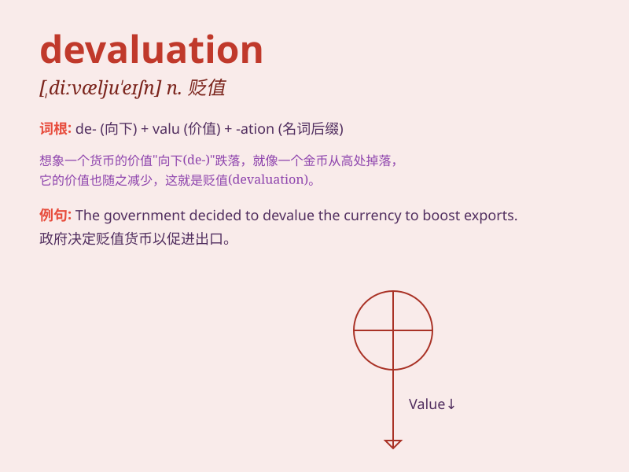

## devaluation

**英音:** _[,diːvæljʊ\'eɪʃən]_ **美音:**
_[,divæljʊ\'eʃən]_

**译义:** *n.(货币)贬值*

### 短语

+ **currency devaluation:** _货币贬值_

+ **exchange rate devaluation:** _汇率贬值_

+ **severe devaluation:** _严重贬值_

+ **prevent devaluation:** _防止贬值_

+ **economic devaluation:** _经济贬值_

### 例句

#### 例句1

> **The devaluation of the currency led to economic instability.**

**中文翻译:** 货币的贬值导致了经济不稳定。

**单词释义:** 货币贬值

#### 例句2

> **The company suffered from the devaluation of its assets.**

**中文翻译:** 这家公司因资产贬值而遭受损失。

**单词释义:** 资产贬值

#### 例句3

> **Devaluation can have a significant impact on international
trade.**

**中文翻译:** 贬值会对国际贸易产生重大影响。

**单词释义:** 贬值

### 背诵小故事

> A country\'s currency was facing devaluation. People were worried as
the value of their money dropped. Businesses struggled, and imports
became more expensive. It was a chaotic situation that needed to be
fixed.

**一个国家的货币面临贬值。人们忧心忡忡，因为他们的钱贬值了。企业举步维艰，进口商品变得更贵。这是一个需要解决的混乱局面。**

### 图义

