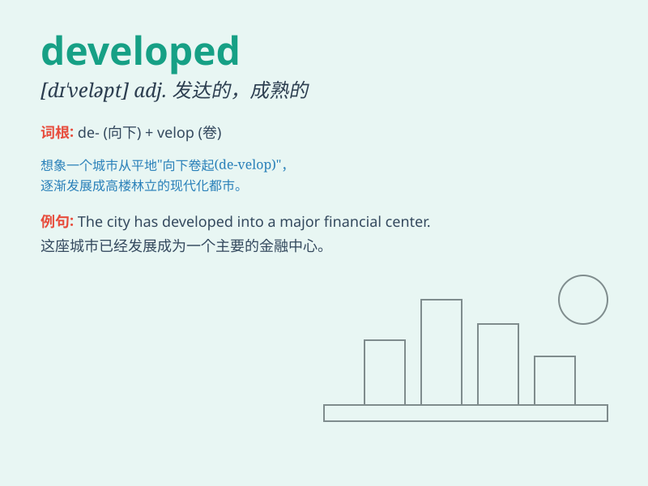

## developed

**英音:** _[dɪˈveləpt]_ **美音:** _[dɪˈvɛləpt]_

**译义:** *adj. 发达的，先进的；成熟的*

### 短语

+ **developed country:** _发达国家_

+ **developed area:** _发达地区_

+ **highly developed:** _高度发达的_

+ **developed economy:** _发达的经济_

+ **well-developed:** _发育良好的；完善的_

### 例句

#### 例句1

> **The country has developed rapidly in recent years.**

**中文翻译:** 这个国家近年来发展迅速。

**单词释义:** 发展（动词的过去分词形式，表完成的动作）

#### 例句2

> **She has developed a strong interest in music.**

**中文翻译:** 她培养出了对音乐的浓厚兴趣。

**单词释义:** 培养；形成（动词的过去分词形式）

#### 例句3

> **The photographs developed well.**

**中文翻译:** 这些照片冲洗得很好。

**单词释义:** （使）显影；冲印（动词的过去分词形式）

### 背诵小故事

> In a faraway land, a small village gradually transformed. New roads
were built, houses expanded. It became a developed place with modern
facilities. People lived a better life. Remember, \'developed\' means
having advanced and improved.

**在一个遥远的地方，有一个小村庄逐渐发生了变化。新的道路修建起来，房屋增多了。它变成了一个有着现代化设施的发达之地。人们过上了更好的生活。记住，'developed'意思是先进的、发达的、完善的。**

### 图义

