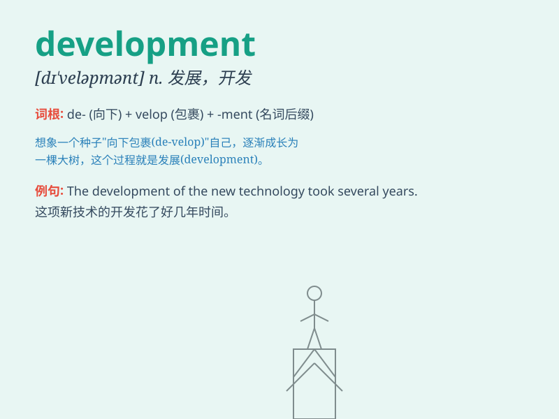

## development

**英音:** _[dɪ\'veləpm(ə)nt]_ **美音:**
_[dɪ\'vɛləpmənt]_

**译义:** *n.发展*

### 短语

+ **economic development:** _经济发展_

+ **sustainable development:** _可持续发展_

+ **development plan:** _发展计划_

+ **child development:** _儿童发展_

+ **software development:** _软件开发_

### 例句

#### 例句1

> **The development of new technologies has changed our lives
greatly.**

**中文翻译:** 新技术的发展极大地改变了我们的生活。

**单词释义:** 发展；开发

#### 例句2

> **The child is showing rapid development in language skills.**

**中文翻译:** 这个孩子在语言技能方面显示出快速的发展。

**单词释义:** 发育；成长

#### 例句3

> **The company is planning a new development in the overseas
market.**

**中文翻译:** 这家公司正计划在海外市场有新的发展。

**单词释义:** 发展；进展

### 背诵小故事

> A young scientist was passionate about finding a cure. Through
countless experiments and efforts, he made significant progress. This
progress was the development of a potential new medicine that could save
many lives.

**一位年轻的科学家热衷于寻找一种治疗方法。通过无数次的实验和努力，他取得了重大的进展。这种进展就是一种可能拯救许多生命的新药物的研发。**

### 图义

