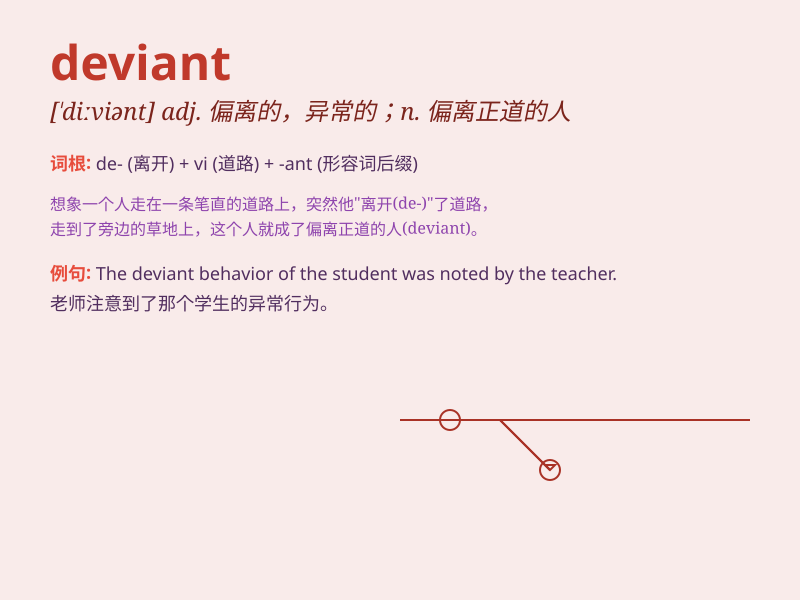

## deviant

**英音:** _[\'diːvɪənt]_ **美音:** _[\'divɪənt]_

**译义:** *adj.不正常的n.不正常的人或物*

### 短语

+ **deviant behavior:** _越轨行为；偏差行为_

+ **deviant conduct:** _不正当行为；异常行为_

+ **deviant individual:** _异常个体；偏离常规的人_

+ **deviant pattern:** _偏差模式；异常模式_

+ **deviant tendency:** _偏离倾向；异常倾向_

### 例句

#### 例句1

> **His deviant behavior at the party shocked everyone.**

**中文翻译:** 他在聚会上的异常行为震惊了所有人。

**单词释义:** 异常的，不正常的

#### 例句2

> **The deviant teenager often skipped school and got into
trouble.**

**中文翻译:** 这个行为乖张的青少年经常逃学并惹上麻烦。

**单词释义:** 行为不端的，偏离常规的

#### 例句3

> **The study focuses on deviant social phenomena.**

**中文翻译:** 这项研究聚焦于异常的社会现象。

**单词释义:** 偏离常轨的

### 背诵小故事

> A young artist was considered deviant as he painted in a very unique
style. But his deviation led to a new art trend. People then realized
that being deviant can sometimes bring innovation.

**一位年轻的艺术家因其独特的绘画风格被认为是离经叛道的。但他的这种偏离常规却引领了新的艺术潮流。人们这才意识到离经叛道有时能带来创新。**

### 图义

