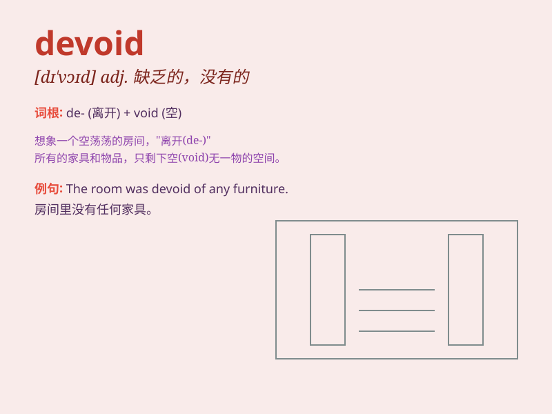

## devoid

**英音:** _[dɪ\'vɒɪd]_ **美音:** _[dɪ\'vɔɪd]_

**译义:** *adj.全无的,缺乏的*

### 短语

+ **devoid of:** _没有；缺乏_

+ **be devoid:** _是缺乏的_

+ **entirely devoid:** _完全缺乏_

+ **seemingly devoid:** _看似缺乏_

+ **apparently devoid:** _显然缺乏_

### 例句

#### 例句1

> **The room was devoid of furniture.**

**中文翻译:** 房间里没有家具。

**单词释义:** 没有；缺乏

#### 例句2

> **His speech was devoid of any humor.**

**中文翻译:** 他的讲话毫无幽默感。

**单词释义:** 毫无；没有

#### 例句3

> **The landscape was devoid of life.**

**中文翻译:** 风景毫无生机。

**单词释义:** 毫无；没有

### 背诵小故事

> A traveler was lost in a desert, devoid of water and food. He felt
hopeless until he found an oasis. \'Devoid\' here means completely
lacking. So remember, when you\'re devoid of something, it\'s like being
in that desperate situation with nothing.

**一位旅行者在沙漠中迷路了，完全没有水和食物。他感到绝望，直到发现了一片绿洲。"devoid"在这里意味着完全缺乏。所以记住，当你devoid某物时，就像处于那种一无所有的绝望境地。**

### 图义

