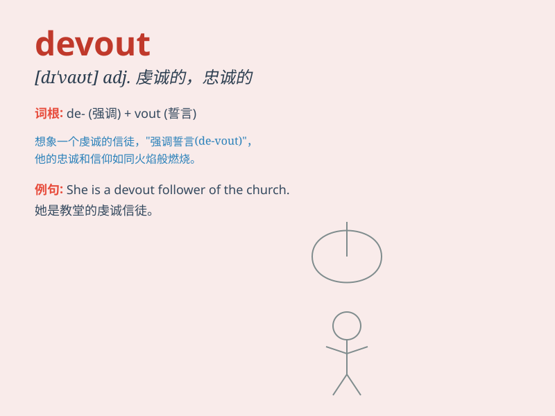

## devout

**英音:** _[dɪ\'vaʊt]_ **美音:** _[dɪ\'vaʊt]_

**译义:** *adj.虔敬的,诚恳的*

### 短语

+ **devout Christian:** _虔诚的基督徒_

+ **devout prayer:** _虔诚的祈祷_

+ **devout belief:** _虔诚的信仰_

+ **devout follower:** _虔诚的追随者_

+ **devout catholic:** _虔诚的天主教徒_

### 例句

#### 例句1

> **She is a devout Christian and attends church every Sunday.**

**中文翻译:** 她是一名虔诚的基督徒，每周日都去教堂。

**单词释义:** 虔诚的

#### 例句2

> **The devout man spent hours in prayer each day.**

**中文翻译:** 这位虔诚的人每天花几个小时祈祷。

**单词释义:** 虔诚的

#### 例句3

> **His devout belief in justice led him to fight for the
oppressed.**

**中文翻译:** 他对正义的虔诚信念促使他为受压迫者而战。

**单词释义:** 虔诚的

### 背诵小故事

> A devout monk spent every day praying in the quiet temple. He was so
devoted to his faith that he never missed a single prayer. His devout
heart was an example for all.

**一位虔诚的僧侣每天都在安静的寺庙里祈祷。他对自己的信仰如此虔诚，从未错过一次祈祷。他的虔诚之心成为了所有人的榜样。**

### 图义

