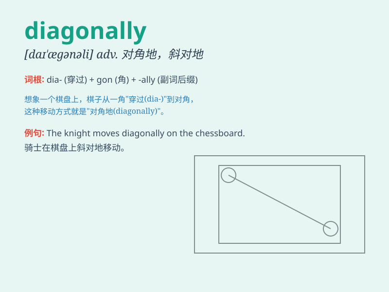

## diagonally

**英音:** _[daɪ\'æg(ə)nəlɪ; daɪ\'ægən(ə)lɪ]_ **美音:**
_[daɪ\'ægənəli]_

**译义:** *adv.对角地*

### 短语

+ **diagonally opposite:** _对角的，斜对的_

+ **move diagonally:** _斜向移动_

+ **look diagonally:** _斜着看_

+ **run diagonally:** _斜跑_

+ **walk diagonally:** _斜走_

### 例句

#### 例句1

> **The path runs diagonally across the field.**

**中文翻译:** 这条路斜穿过田野。

**单词释义:** 斜着；对角地

#### 例句2

> **She looked diagonally at him.**

**中文翻译:** 她斜眼看着他。

**单词释义:** 斜向

#### 例句3

> **The building is located diagonally opposite the park.**

**中文翻译:** 该建筑位于公园斜对面。

**单词释义:** 对角地；斜对着

### 背诵小故事

> One day, a little ant was walking diagonally across a square field.
It took a special path, not straight but at an angle. This way, it found
a hidden piece of candy. Remember, diagonally means in a slanting
direction.

**有一天，一只小蚂蚁对角地穿过一个方形的田野。它走了一条特别的路，不是直的而是倾斜的。就这样，它找到了一块隐藏的糖果。记住，diagonally
意思是斜着，对角地。**

### 图义

