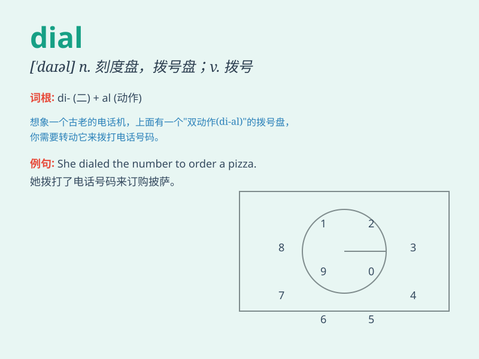

## dial

**英音:** _[\'daɪəl]_ **美音:** _[\'daɪəl]_

**译义:** *n.刻度盘,钟面,转盘,(自动电话)拨号盘v.拨*

### 短语

+ **dial the number:** _拨打号码_

+ **dial a wrong number:** _拨错号码_

+ **dial slowly:** _慢慢拨号_

+ **dial frequently:** _频繁拨号_

+ **dial accurately:** _准确拨号_

### 例句

#### 例句1

> **I dialed the wrong number.**

**中文翻译:** 我拨错号码了。

**单词释义:** 拨打

#### 例句2

> **She dialed the police emergency number.**

**中文翻译:** 她拨打了警方的紧急电话。

**单词释义:** 拨打

#### 例句3

> **He carefully dialed the combination to open the safe.**

**中文翻译:** 他小心翼翼地拨通密码，打开了保险箱。

**单词释义:** 拨（号码、密码等）

### 背诵小故事

>
想象一下，你在一个古老的城堡中，面前有一个神秘的表盘（dial），你转动它就能打开通往宝藏的门。你小心翼翼地dial，每转动一格都充满期待，最终门开了，宝藏展现在眼前。

**想象一下，你在一座古老的城堡里，面前有一个神秘的表盘，你转动它就能打开通往宝藏的门。你小心地转动表盘，每转一格都满怀期待，最终门开了，宝藏出现了。**

### 图义

