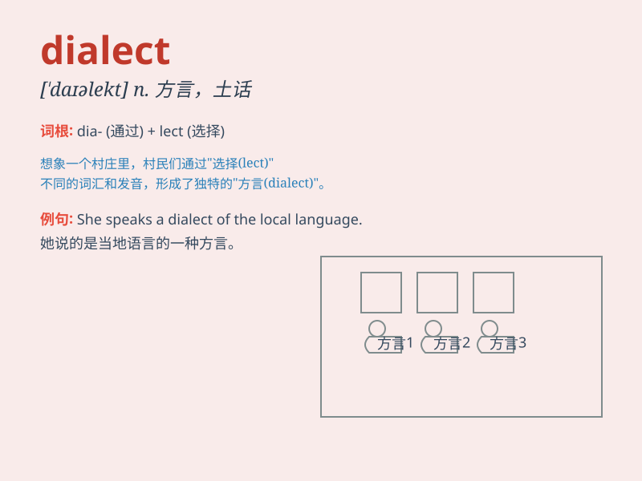

## dialect

**英音:** _[\'daɪəlekt]_ **美音:** _[\'daɪə\'lɛkt]_

**译义:** *n.方言,语调*

### 短语

+ **regional dialect:** _地区方言_

+ **local dialect:** _当地方言_

+ **dialect variation:** _方言变体_

+ **study a dialect:** _研究一种方言_

+ **preserve a dialect:** _保护一种方言_

### 例句

#### 例句1

> **The dialect of this region is quite unique.**

**中文翻译:** 这个地区的方言非常独特。

**单词释义:** 方言

#### 例句2

> **She is studying the dialects of different ethnic groups.**

**中文翻译:** 她正在研究不同民族的方言。

**单词释义:** 方言

#### 例句3

> **The novel is written in a dialect that reflects the local
culture.**

**中文翻译:** 小说是用反映当地文化的方言写成的。

**单词释义:** 方言

### 背诵小故事

> In a small village, people spoke a special language, a dialect. It
was like a secret code among them. One outsider came and struggled to
understand. But with time, he learned and felt the unique charm of this
dialect.

**在一个小村庄里，人们说着一种特殊的语言，即方言。它就像他们之间的秘密代码。一个外来者来了，费力去理解。但随着时间推移，他学会了并感受到这种方言的独特魅力。**

### 图义

