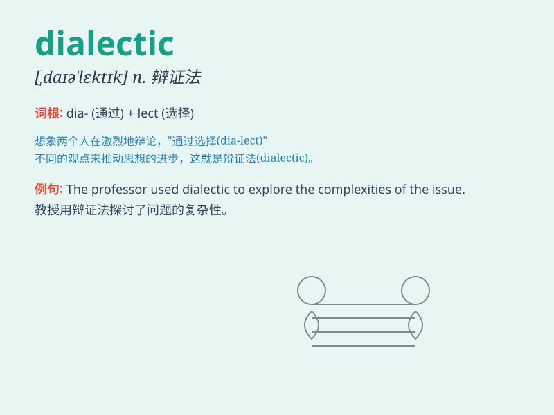

## dialectic

**英音:** _[,daɪə\'lektɪk]_ **美音:** _[,daɪə\'lɛktɪk]_

**译义:** *adj.辩证的*

### 短语

+ **dialectic method:** _辩证方法_

+ **dialectic process:** _辩证过程_

+ **dialectic thinking:** _辩证思维_

+ **historical dialectic:** _历史辩证法_

+ **materialist dialectic:** _唯物辩证法_

### 例句

#### 例句1

> **The dialectic between theory and practice is crucial in academic
research.**

**中文翻译:** 理论与实践的辩证关系在学术研究中至关重要。

**单词释义:** 辩证关系

#### 例句2

> **His thinking is based on a profound understanding of
dialectic.**

**中文翻译:** 他的思想建立在对辩证法的深刻理解之上。

**单词释义:** 辩证法

#### 例句3

> **The dialectic process often leads to new insights and
solutions.**

**中文翻译:** 辩证过程往往会带来新的见解和解决方案。

**单词释义:** 辩证的过程

### 背诵小故事

>
从前有个聪明的学者，总是通过精彩的辩论来探究真理。他擅长运用一种叫做\'dialectic\'的方法，即通过对话和争论，揭示事物的本质和内在矛盾。最终，他的智慧让众人折服。

**从前有个学者擅长运用辩证的方法，通过辩论揭示事物本质和内在矛盾，这个方法叫\'dialectic\'，最终他的智慧令人折服。**

### 图义

