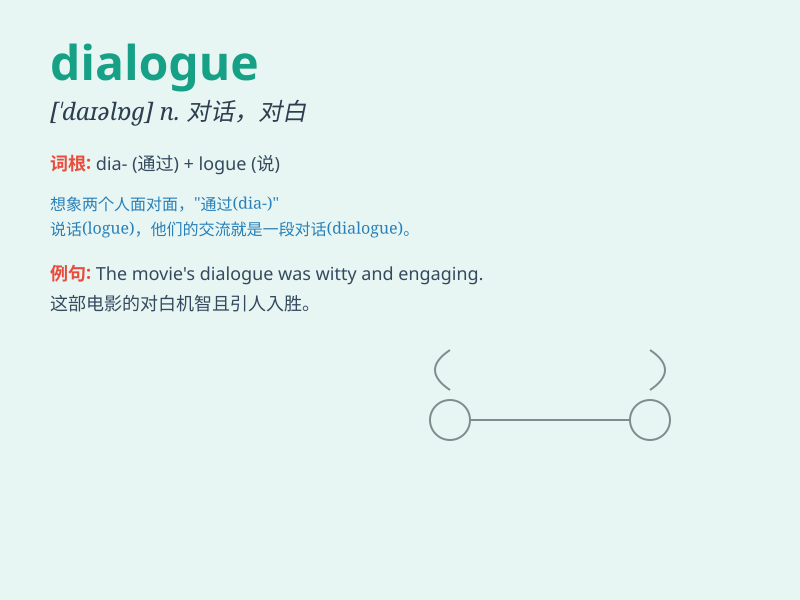

## dialogue

**英音:** _[\'daɪəlɒg]_ **美音:** _[ˈdaɪəˌlɔɡ]_

**译义:** *n.对话*

### 短语

+ **carry on a dialogue:** _进行对话_

+ **open dialogue:** _公开对话_

+ **constructive dialogue:** _建设性对话_

+ **frank dialogue:** _坦率的对话_

+ **intense dialogue:** _激烈的对话_

### 例句

#### 例句1

> **The dialogue between the two leaders was very productive.**

**中文翻译:** 两国领导人的对话富有成果。

**单词释义:** 对话

#### 例句2

> **The play is full of witty dialogues.**

**中文翻译:** 该剧充满了诙谐的对话。

**单词释义:** 对白

#### 例句3

> **We need to have an open dialogue to solve this problem.**

**中文翻译:** 我们需要进行公开对话来解决这个问题。

**单词释义:** 对话

### 背诵小故事

> 在一个神秘的森林里，小动物们展开了一场精彩的
dialogue。兔子和松鼠在交流哪里的胡萝卜最甜，猴子和鸟儿在讨论如何建造舒适的巢穴。大家各抒己见，氛围热烈。

**在一个神秘的森林里，小动物们展开了一场精彩的对话。兔子和松鼠在交流哪里的胡萝卜最甜，猴子和鸟儿在讨论如何建造舒适的巢穴。大家各抒己见，氛围热烈。**

### 图义

