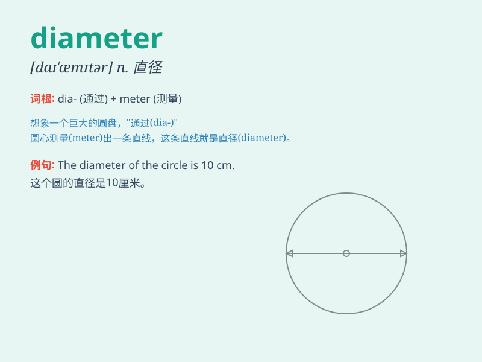

## diameter

**英音:** _[daɪ\'æmɪtə]_ **美音:** _[daɪ\'æmɪtɚ]_

**译义:** *n.直径*

### 短语

+ **inside diameter:** _内径_

+ **outside diameter:** _外径_

+ **mean diameter:** _平均直径_

+ **piston diameter:** _活塞直径_

+ **shaft diameter:** _轴径_

### 例句

#### 例句1

> **The diameter of the tree trunk was over two meters.**

**中文翻译:** 树干的直径足有两米多。

**单词释义:** 直径

#### 例句2

> **The diameter of the circle is twice the radius.**

**中文翻译:** 圆的直径是半径的两倍。

**单词释义:** 直径

#### 例句3

> **The engineer measured the diameter of the pipe precisely.**

**中文翻译:** 工程师精确地测量了管道的直径。

**单词释义:** 直径

### 背诵小故事

>
想象一个圆形的大蛋糕，要把它平均切成两半。从蛋糕的一边直直地切到另一边的这条线的长度，就是直径（diameter）。就像一把利剑穿过蛋糕，这就是测量圆大小的关键。

**想象一个圆形蛋糕，从一边到另一边直直切开的线的长度就是直径，用这个故事来辅助记忆。**

### 图义

