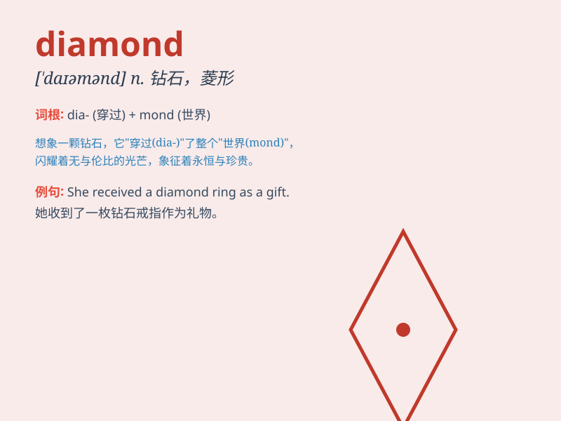

## diamond

**英音:** _[\'daɪəmənd]_ **美音:** _[\'daɪəmənd]_

**译义:** *n.钻石,菱形*

### 短语

+ **diamond ring:** _钻石戒指_

+ **diamond necklace:** _钻石项链_

+ **diamond studded:** _镶钻的_

+ **diamond mine:** _钻石矿_

+ **diamond cut:** _钻石切割_

### 例句

#### 例句1

> **She wore a beautiful diamond necklace to the party.**

**中文翻译:** 她戴着一条漂亮的钻石项链参加聚会。

**单词释义:** 钻石

#### 例句2

> **The baseball field was in the shape of a diamond.**

**中文翻译:** 棒球场呈菱形。

**单词释义:** 菱形

#### 例句3

> **He is a diamond in the rough.**

**中文翻译:** 他是一颗未经加工的钻石。

**单词释义:** 非常有价值的人或物

### 背诵小故事

> A prince was lost in a forest. Just when he felt hopeless, he saw a
light and followed it. There was a cave with a diamond shining brightly.
It guided him out and became a symbol of hope and luck.

**一位王子在森林中迷路了。就在他感到绝望时，他看到了一束光并跟着它。有一个洞穴，里面有一颗钻石闪闪发光。它引导他走出森林，成为了希望和幸运的象征。**

### 图义

