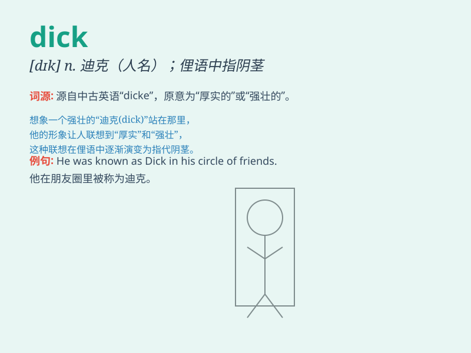

## dick

**英音:** _[dɪk]_ **美音:** _[dɪk]_

**译义:**
*n.\<美俚>\<俗>侦探,家伙,(=dictinary)词典,声明n.\<俚>阴茎,鸡巴 Dick
迪克(男子名)*

### 短语

+ **Tom Dick and Harry:** _普通人；张三李四_

+ **dick around:** _浪费时间；闲荡_

+ **dick up:** _弄糟；搞乱_

+ **smart dick:** _自以为聪明的家伙_

+ **dick in the dirt:** _非常疲倦；精疲力竭_

### 例句

#### 例句1

> **Dick is a very friendly person.**

**中文翻译:** 迪克是一个非常友善的人。

**单词释义:** 人名，迪克

#### 例句2

> **I saw Dick at the supermarket yesterday.**

**中文翻译:** 我昨天在超市见到迪克。

**单词释义:** 人名，迪克

#### 例句3

> **Don\'t be such a dick!**

**中文翻译:** 别这么混蛋！

**单词释义:** 混蛋；蠢货（粗俗用语）

### 背诵小故事

> There was a man named Dick. He was very kind and always helped
others. One day, he found a lost puppy and spent a lot of time looking
for its owner. Everyone loved Dick for his big heart.

**有个叫迪克的男人。他非常善良，总是帮助别人。有一天，他发现了一只走失的小狗，并花了很多时间寻找它的主人。每个人都因为他的善良之心喜欢迪克。**

### 图义

