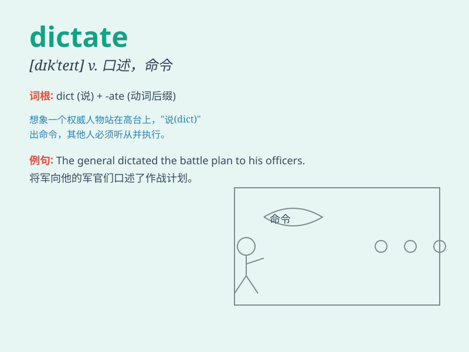

## dictate

**英音:** _[dɪk\'teɪt]_ **美音:** _[\'dɪktet]_

**译义:**
*v.口述,口授,使听写,指令,指示,命令,规定n.指示(指理智,变心)*

### 短语

+ **dictate to:** _对\...发号施令_

+ **dictate terms:** _规定条件_

+ **dictate a letter:** _口述一封信_

+ **dictate pace:** _决定速度_

+ **dictate policy:** _制定政策_

### 例句

#### 例句1

> **The boss dictated the terms of the contract to the employees.**

**中文翻译:** 老板向员工规定了合同的条款。

**单词释义:** 口述；命令

#### 例句2

> **Fate seemed to dictate that she should remain alone.**

**中文翻译:** 命运似乎注定了她只能孤身一人。

**单词释义:** 支配；决定

#### 例句3

> **He can\'t write but he can dictate letters to his secretary.**

**中文翻译:** 他不会写信，但他可以口述信件给他的秘书。

**单词释义:** 口述

### 背诵小故事

>
国王总是dictate（口述；命令）臣民做事，有一天他dictate了一个不合理的要求，大家都很不满。但没人敢违抗，只能照做。

**国王总是口述、命令臣民做事，有一天他下达了一个不合理的要求，大家都很不满。但没人敢违抗，只能照做。**

### 图义

