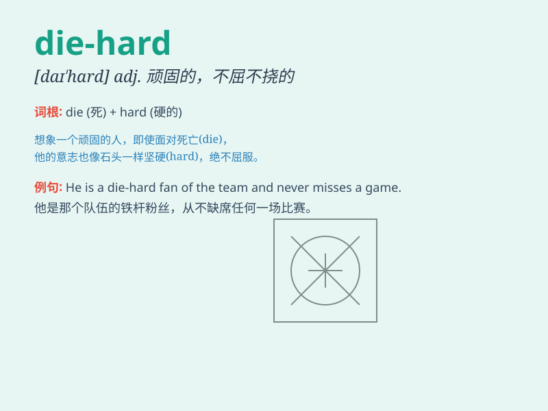

## die-hard

**英音:** _[daɪ hɑːrd]_ **美音:** _[daɪ hɑrd]_

**译义:** *adj.顽固的，不屈不挠的；n.顽固分子，死硬派*

### 短语

+ **die-hard fan:** _铁杆粉丝_

+ **die-hard supporter:** _坚定的支持者_

+ **die-hard traditionalist:** _顽固的传统主义者_

+ **die-hard optimist:** _坚定不移的乐观主义者_

+ **die-hard believer:** _深信不疑的信徒_

### 例句

#### 例句1

> **He is a die-hard fan of rock music.**

**中文翻译:** 他是摇滚乐的死忠粉。

**单词释义:** 顽固的；死硬的；坚定的

#### 例句2

> **The die-hard supporters refused to give up their beliefs.**

**中文翻译:** 那些顽固的支持者拒绝放弃他们的信仰。

**单词释义:** 坚决的；坚定的

#### 例句3

> **She\'s a die-hard optimist, always seeing the bright side.**

**中文翻译:** 她是个坚定不移的乐观主义者，总是看到事情好的一面。

**单词释义:** 坚定的；坚决的

### 背诵小故事

> There was a die-hard soldier in the war. No matter how fierce the
battle was, he refused to retreat. His die-hard spirit inspired all. He
was determined to fight until the end.

**在战争中有一位顽固的士兵。无论战斗多么激烈，他都拒绝撤退。他顽固的精神鼓舞了所有人。他决心战斗到底。**

### 图义

