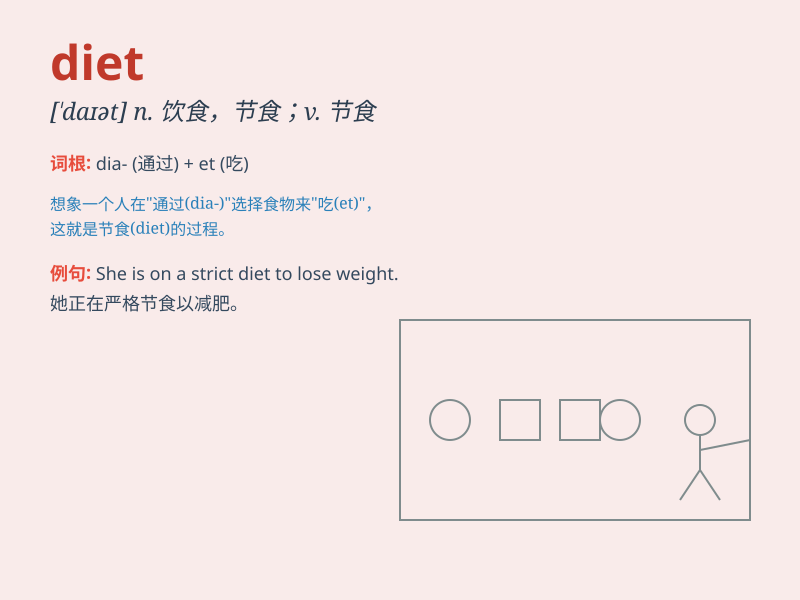

## diet

**英音:** _[\'daɪət]_ **美音:** _[\'daɪət]_

**译义:** *n.通常所吃的食物,会议*

### 短语

+ **balanced diet:** _均衡饮食_

+ **on a diet:** _节食；按规定饮食_

+ **diet coke:** _健怡可乐_

+ **diet pills:** _减肥药_

+ **diet plan:** _饮食计划_

### 例句

#### 例句1

> **She is on a strict diet to lose weight.**

**中文翻译:** 她正在严格节食以减肥。

**单词释义:** 节食；规定饮食

#### 例句2

> **The doctor recommended a balanced diet for him.**

**中文翻译:** 医生建议他均衡饮食。

**单词释义:** 日常饮食；饮食

#### 例句3

> **The dog has a special diet because of its health problem.**

**中文翻译:** 由于健康问题，这只狗有特殊的饮食习惯。

**单词释义:** （因医疗等）特定饮食

### 背诵小故事

> A mouse was on a special diet. It could only eat healthy grains. But
one day, it smelled cheese and forgot the diet. Now it realizes the
importance of sticking to the diet!

**一只老鼠正在进行特殊的饮食控制。它只能吃健康的谷物。但有一天，它闻到了奶酪的味道，就忘记了饮食控制。现在它明白了坚持饮食控制的重要性！**

### 图义

