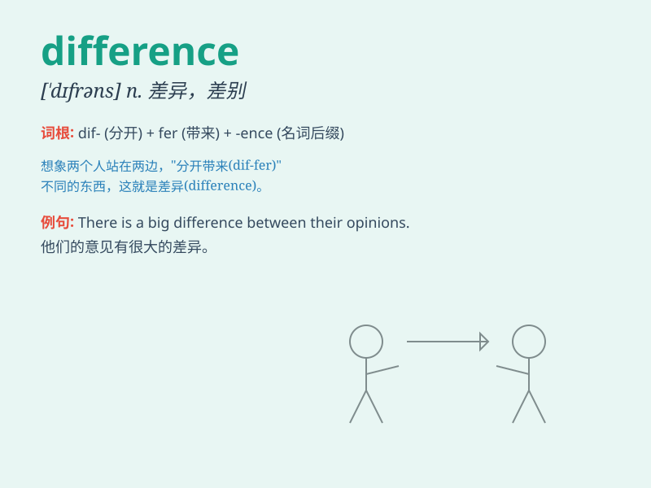

## difference

**英音:** _[\'dɪf(ə)r(ə)ns]_ **美音:** _[\'dɪfrəns]_

**译义:**
*n.差异,差别,分歧,争论,[数]差额,差分adj.[数]微分的,[机]差动的*

### 短语

+ **make a difference:** _有影响；起作用_

+ **difference in:** _在......方面的差异_

+ **tell the difference:** _区分；辨别_

+ **big difference:** _巨大的差异_

+ **small difference:** _细微的差别_

### 例句

#### 例句1

> **There is a big difference between these two cars.**

**中文翻译:** 这两款车有很大的区别。

**单词释义:** 差别；差异

#### 例句2

> **What is the difference in price between the two models?**

**中文翻译:** 两种型号的价格有何差异？

**单词释义:** 差别；差异

#### 例句3

> **It makes no difference to me whether you come or not.**

**中文翻译:** 你来或不来对我来说都没有区别。

**单词释义:** 影响；关系

### 背诵小故事

> One day, Tom and Jerry compared their toys. Tom had a car, while
Jerry had a plane. They found the DIFFERENCE between the toys and
realized each had its own fun.

**有一天，汤姆和杰瑞比较他们的玩具。汤姆有一辆小汽车，而杰瑞有一架飞机。他们发现了玩具之间的不同，并意识到每个玩具都有自己的乐趣。**

### 图义

