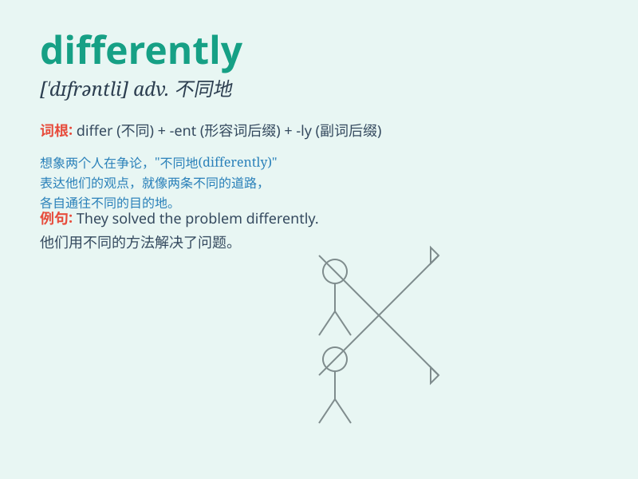

## differently

**英音:** _[\'dɪfərəntlɪ]_ **美音:** _[\'dɪfərəntli]_

**译义:** *adv.不同地*

### 短语

+ **think differently:** _有不同的想法_

+ **behave differently:** _表现不同_

+ **see things differently:** _对事物有不同的看法_

+ **react differently:** _反应不同_

+ **approach differently:** _以不同的方式处理_

### 例句

#### 例句1

> **He thinks differently from me.**

**中文翻译:** 他的想法和我不一样。

**单词释义:** 不同地

#### 例句2

> **The two sisters dress differently.**

**中文翻译:** 两姐妹的着装各有不同。

**单词释义:** 不同地

#### 例句3

> **People solve problems differently.**

**中文翻译:** 人们解决问题的方式不同。

**单词释义:** 不同地

### 背诵小故事

> Once upon a time, two friends had different opinions on where to
travel. One wanted to go to the beach, the other to the mountains. They
handled the situation differently. Finally, they compromised and went to
a lake.

**从前，两个朋友对于去哪里旅行有不同的意见。一个想去海滩，另一个想去山区。他们处理这种情况的方式不同。最后，他们妥协去了一个湖。**

### 图义

