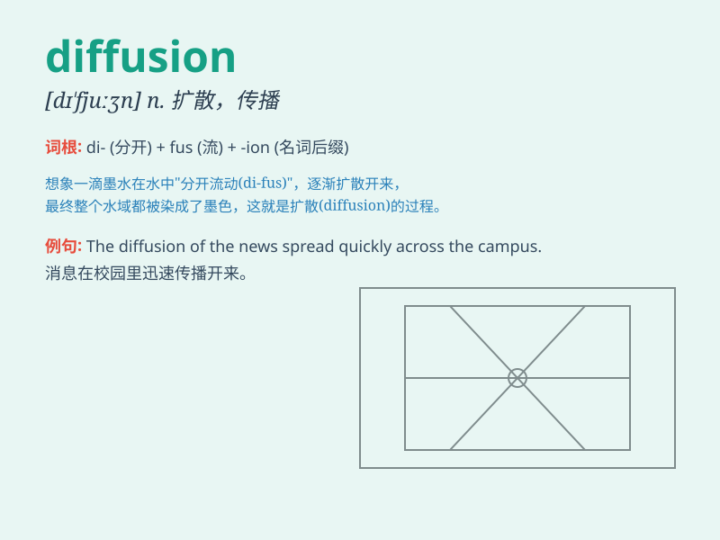

## diffusion

**英音:** _[dɪ\'fjuːʒ(ə)n]_ **美音:** _[dɪ\'fjʊʒən]_

**译义:** *n.扩散,传播,漫射*

### 短语

+ **diffusion coefficient:** _扩散系数_

+ **diffusion process:** _扩散过程_

+ **thermal diffusion:** _热扩散_

+ **diffusion barrier:** _扩散阻挡层_

+ **gaseous diffusion:** _气体扩散_

### 例句

#### 例句1

> **The diffusion of knowledge is essential for the progress of
society.**

**中文翻译:** 知识的传播对于社会的进步至关重要。

**单词释义:** 传播；扩散

#### 例句2

> **The diffusion of light through the window created a soft glow in
the room.**

**中文翻译:** 光线透过窗户的扩散在房间里营造出柔和的光芒。

**单词释义:** 扩散

#### 例句3

> **The new technology has led to the rapid diffusion of
information.**

**中文翻译:** 这项新技术导致了信息的迅速传播。

**单词释义:** 传播

### 背诵小故事

>
想象一个充满烟雾的房间，烟雾从一个点慢慢散开，弥漫到整个房间。这种烟雾的散开过程就像diffusion（扩散）。人们努力打开窗户，让烟雾能更快地向外diffusion，以恢复房间的清新。

**想象一个充满烟雾的房间，烟雾从一个点慢慢散开的过程就像"扩散"。人们开窗让烟雾更快向外扩散以恢复清新。**

### 图义

