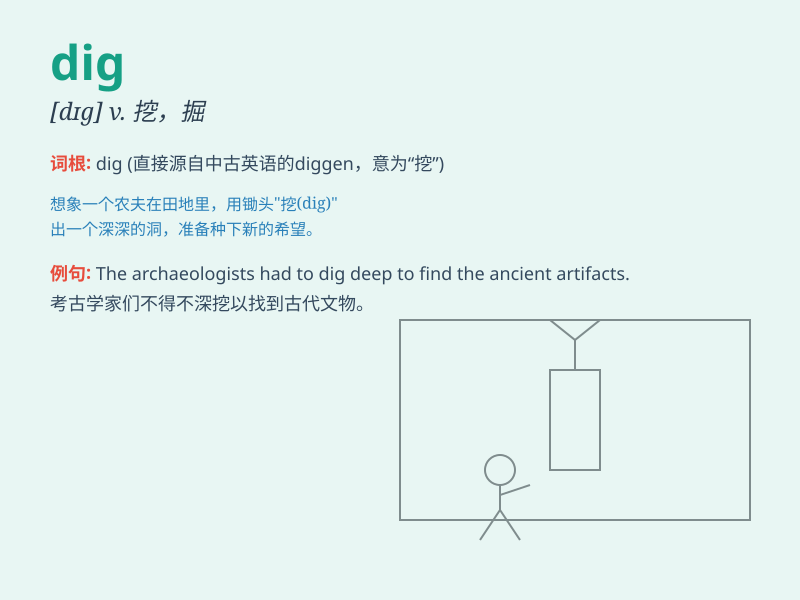

## dig

**英音:** _[dɪg]_ **美音:** _[dɪɡ]_

**译义:** *v.掘,挖,钻研,搜集*

### 短语

+ **dig in:** _开始认真做；尽情享用_

+ **dig out:** _挖出；找出_

+ **dig up:** _掘起；找到_

+ **dig deep:** _深挖；深入探究_

+ **dig into:** _钻研；探究_

### 例句

#### 例句1

> **They are digging a hole in the ground.**

**中文翻译:** 他们正在地上挖一个洞。

**单词释义:** 挖

#### 例句2

> **I need to dig out some old photos from the attic.**

**中文翻译:** 我需要从阁楼里找出一些旧照片。

**单词释义:** 找出

#### 例句3

> **He really knows how to dig up interesting stories.**

**中文翻译:** 他真的知道如何挖掘出有趣的故事。

**单词释义:** 挖掘

### 背诵小故事

> One day, a little boy was playing in the garden. He saw a beautiful
flower and wanted to give it to his mother. So he used a small shovel to
dig the soil and carefully took out the flower. The action of using the
shovel is \'dig\'.

**有一天，一个小男孩在花园里玩耍。他看到一朵漂亮的花，想送给妈妈。于是他用小铲子挖土，小心地把花取出来。用铲子挖土这个动作就是'dig'。**

### 图义

