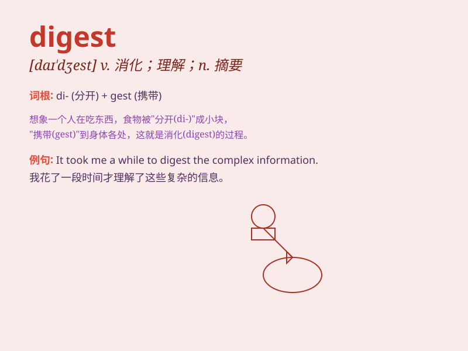

## digest

**英音:** _[daɪ\'dʒest; dɪ-]_ **美音:** _[daɪ\'dʒɛst]_

**译义:** *n.分类,摘要vi.消化vt.消化,融会贯通*

### 短语

+ **digest food:** _消化食物_

+ **easy to digest:** _容易消化_

+ **digest information:** _领会信息_

+ **a digest of news:** _新闻摘要_

+ **digestive system:** _消化系统_

### 例句

#### 例句1

> **It takes time to digest all the information.**

**中文翻译:** 消化所有这些信息需要时间。

**单词释义:** 消化（理解、吸收）

#### 例句2

> **The doctor gave him some medicine to help him digest his
food.**

**中文翻译:** 医生给他开了些药帮助他消化食物。

**单词释义:** 消化（食物）

#### 例句3

> **I need a few minutes to digest what you just said.**

**中文翻译:** 我需要几分钟来领会你刚刚说的话。

**单词释义:** 领会、理解

### 背诵小故事

> A detective was trying to digest a complex case. He read many
documents and finally understood the clues. Just like our stomach
digests food, his brain digested the information to solve the mystery.

**一位侦探试图理解一个复杂的案子。他阅读了许多文件，最终明白了线索。就像我们的胃消化食物一样，他的大脑消化了信息来解开谜团。**

### 图义

