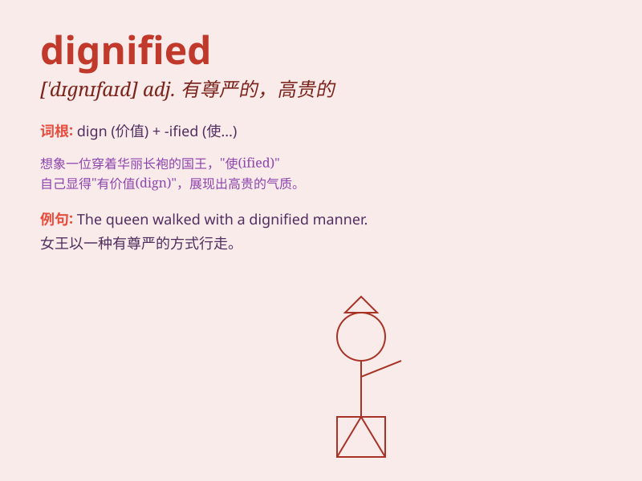

## dignified

**英音:** _[\'dɪgnɪfaɪd]_ **美音:** _[\'dɪɡnɪfaɪd]_

**译义:** *adj.有威严的,有品格的*

### 短语

+ **dignified appearance:** _有尊严的外表_

+ **dignified manner:** _庄重的举止_

+ **dignified silence:** _庄重的沉默_

+ **dignified bearing:** _高贵的仪态_

+ **dignified retreat:** _体面的撤退_

### 例句

#### 例句1

> **The president carried himself with a dignified manner during the
ceremony.**

**中文翻译:** 总统在仪式期间举止庄重。

**单词释义:** 庄重的；有尊严的

#### 例句2

> **She gave a dignified response to the criticism.**

**中文翻译:** 她对批评给出了有尊严的回应。

**单词释义:** 有尊严的；高贵的

#### 例句3

> **The old building had a dignified appearance.**

**中文翻译:** 这座老建筑外观庄严。

**单词释义:** 庄严的；高贵的

### 背诵小故事

> A king walked into the hall with a dignified manner. His straight
posture and calm expression showed his noble status. Everyone was
impressed by his dignified presence.

**一位国王以威严的姿态走进大厅。他笔直的身姿和沉着的表情显示出他高贵的地位。每个人都对他威严的仪态印象深刻。**

### 图义

