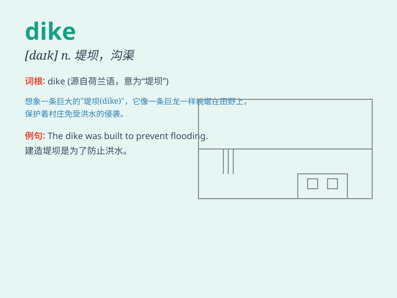

## dike

**英音:** _[daɪk]_ **美音:** _[daɪk]_

**译义:** *n.堤防vt.筑堤提防*

### 短语

+ **dike system:** _堤坝系统_

+ **flood control dike:** _防洪堤_

+ **dike reinforcement:** _堤坝加固_

+ **dike breach:** _堤坝决口_

+ **seawall dike:** _海堤_

### 例句

#### 例句1

> **The dike held back the floodwaters.**

**中文翻译:** 堤坝挡住了洪水。

**单词释义:** 堤坝

#### 例句2

> **Workers are reinforcing the dike to prevent it from
collapsing.**

**中文翻译:** 工人们正在加固堤坝，防止堤坝垮塌。

**单词释义:** 堤坝

#### 例句3

> **The farmer dug a dike to irrigate his fields.**

**中文翻译:** 农夫挖了一条堤坝来灌溉他的田地。

**单词释义:** 堤；沟渠

### 背诵小故事

> A farmer was worried about his fields being flooded. So, he built a
strong DIKE to stop the water. With the dike in place, his crops were
safe and he was happy.

**一位农民担心他的田地被水淹。于是，他建了一道坚固的堤（dike）来挡水。有了这道堤，他的庄稼安全了，他也开心了。**

### 图义

