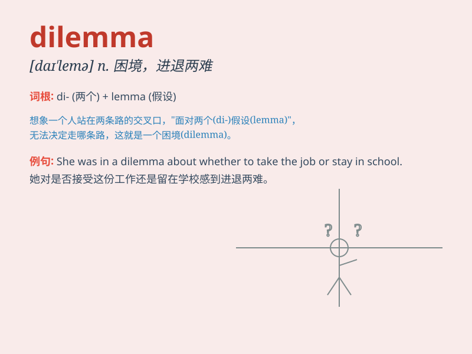

## dilemma

**英音:** _[dɪ\'lemə; daɪ-]_ **美音:** _[dəˈlɛmə, daɪ-]_

**译义:** *n.进退两难的局面,困难的选择*

### 短语

+ **ethical dilemma:** _道德困境_

+ **in a dilemma:** _处于进退两难的境地_

+ **pose a dilemma:** _造成困境_

+ **resolve a dilemma:** _解决困境_

+ **face a dilemma:** _面临困境_

### 例句

#### 例句1

> **She was in a dilemma whether to stay in her current job or look
for a new one.**

**中文翻译:** 她陷入了是留在当前工作还是寻找新工作的困境。

**单词释义:** （进退两难的）困境，窘境

#### 例句2

> **The company faces the dilemma of how to increase profits while
reducing costs.**

**中文翻译:** 公司面临着如何在降低成本的同时增加利润的难题。

**单词释义:** 难题，困境

#### 例句3

> **He found himself in a moral dilemma when he witnessed the crime
but was too scared to report it.**

**中文翻译:**
当他目睹犯罪却因太害怕而不敢举报时，他发现自己陷入了道德困境。

**单词释义:** （道德上的）两难处境

### 背诵小故事

> A man was faced with a dilemma. He had to choose between saving his
job by lying or keeping his integrity by telling the truth. It was a
tough choice and he struggled a lot.

**一个男人面临两难困境。他必须在通过撒谎保住工作和说实话保持正直之间做出选择。这是个艰难的抉择，他纠结了很久。**

### 图义

