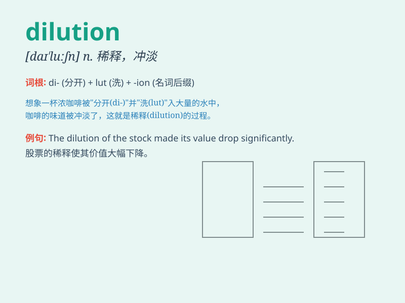

## dilution

**英音:** _[daɪ\'luːʃn]_ **美音:** _[daɪˈluʃn]_

**译义:** *n.稀释,稀释法,冲淡物*

### 短语

+ **dilution ratio:** _稀释比率_

+ **stock dilution:** _股本稀释_

+ **dilution effect:** _稀释效应_

+ **dilution method:** _稀释法_

+ **dilution curve:** _稀释曲线_

### 例句

#### 例句1

> **The dilution of the medicine is necessary before
administration.**

**中文翻译:** 在使用前，对这种药物进行稀释是必要的。

**单词释义:** 稀释

#### 例句2

> **The company\'s share value suffered due to the dilution of
stocks.**

**中文翻译:** 由于股票的稀释，公司的股票价值受损。

**单词释义:** 摊薄，稀释（股票等）

#### 例句3

> **The dilution of his influence was a result of his long
absence.**

**中文翻译:** 他影响力的削弱是他长期缺席的结果。

**单词释义:** 削弱，降低

### 背诵小故事

> A chemist was working on a solution. The more solvent he added, the
greater the dilution. The substance became weaker and less concentrated.
This showed the meaning of \'dilution\' - the act of making something
weaker or less concentrated.

**一位化学家正在处理一种溶液。他添加的溶剂越多，稀释度就越大。这种物质变得更弱且浓度更低。这展示了\'dilution\'的意思 -
使某物变弱或浓度降低的行为。**

### 图义

