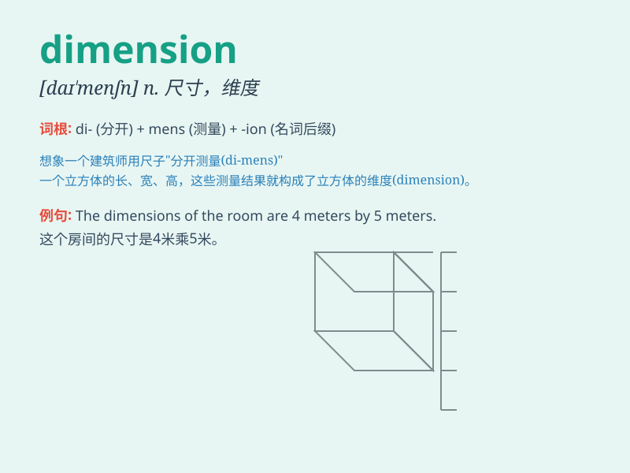

## dimension

**英音:** _[daɪˈmenʃn]_ **美音:** _[dəˈmɛnʃən, daɪ-]_

**译义:** *n.尺寸,尺度,维(数),度(数),元*

### 短语

+ **spatial dimension:** _空间维度_

+ **time dimension:** _时间维度_

+ **extra dimension:** _额外维度_

+ **dimension of personality:** _性格方面_

+ **dimension of problem:** _问题的方面_

### 例句

#### 例句1

> **The room has three dimensions: length, width and height.**

**中文翻译:** 这个房间有三个维度：长度、宽度和高度。

**单词释义:** 维度；方面

#### 例句2

> **We need to consider the dimension of time in this project.**

**中文翻译:** 在这个项目中，我们需要考虑时间方面。

**单词释义:** 方面；因素

#### 例句3

> **The problem is of a different dimension altogether.**

**中文翻译:** 这个问题完全是另一个层面的。

**单词释义:** 规模；程度；范围

### 背诵小故事

>
想象一下，你走进一个神秘的房间，里面有很多不同的通道。每个通道的长度、宽度和高度都不同，这些不同的测量值就是房间的dimension（维度、尺寸）。

**想象你走进神秘房间，其中不同通道的长、宽、高这些测量值就是'维度、尺寸'**

### 图义

