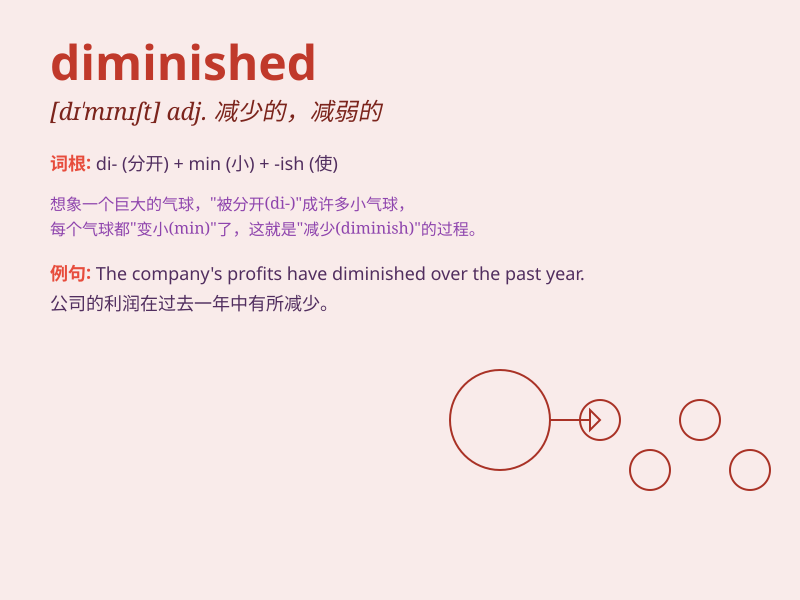

## diminished

**英音:** _[dɪ\'mɪnɪʃt]_ **美音:** _[dɪ\'mɪnɪʃt]_

**译义:** * 减少了的,被贬低的*

### 短语

+ **diminished responsibility:** _减轻的责任_

+ **diminished value:** _减值；价值降低_

+ **diminished capacity:** _能力减弱_

+ **diminished chord:** _减和弦_

+ **diminished returns:** _收益递减_

### 例句

#### 例句1

> **The value of the currency has diminished significantly over the
past year.**

**中文翻译:** 在过去的一年里，货币的价值大幅下降。

**单词释义:** 下降；减少

#### 例句2

> **His influence in the company has diminished since the new
management took over.**

**中文翻译:** 自从新的管理层接管以来，他在公司的影响力已经减弱。

**单词释义:** 减弱；变小

#### 例句3

> **The pain diminished gradually after taking the medicine.**

**中文翻译:** 服药后，疼痛逐渐减轻。

**单词释义:** 减轻；变小

### 背诵小故事

> A king had a vast treasure. But due to his excessive spending, the
size of the treasure diminished. Fewer jewels and gold remained.
Eventually, it was much smaller than before.

**一位国王拥有大量财宝。但由于他过度消费，财宝的规模减小了。剩下的珠宝和黄金更少了。最终，它比以前小了很多。**

### 图义

