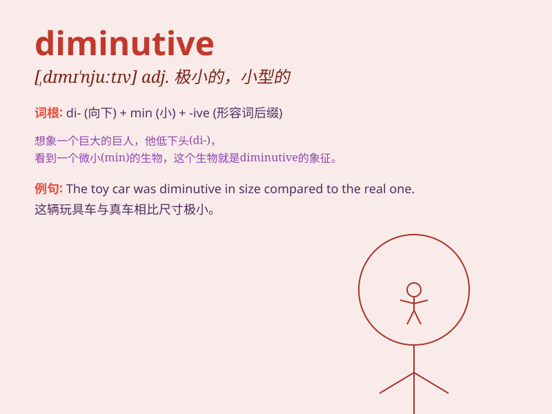

## diminutive

**英音:** _[dɪ\'mɪnjʊtɪv]_ **美音:** _[dɪ\'mɪnjətɪv]_

**译义:** *adj.小的,指小的,小型的n.小的人,指小辞,指小词,爱称*

### 短语

+ **diminutive size:** _极小的尺寸_

+ **diminutive figure:** _矮小的身材_

+ **diminutive creature:** _微小的生物_

+ **diminutive form:** _缩小的形式_

+ **diminutive apartment:** _很小的公寓_

### 例句

#### 例句1

> **The diminutive figure of the child was lost in the crowd.**

**中文翻译:** 那个孩子矮小的身影消失在人群中。

**单词释义:** 矮小的

#### 例句2

> **She has a diminutive nose that gives her a cute look.**

**中文翻译:** 她有一个小巧的鼻子，让她看起来很可爱。

**单词释义:** 小巧的

#### 例句3

> **The diminutive size of the apartment made it difficult to move
around freely.**

**中文翻译:** 这间公寓极小的面积使得自由走动很困难。

**单词释义:** 极小的

### 背诵小故事

> A little fairy had a diminutive wand. It was so small that others
often overlooked it. But with this tiny wand, she could still perform
magical feats. The size didn\'t matter; it was the power within that
counted.

**一个小仙女有一根很小的魔杖。它非常小，以至于其他人经常忽略它。但凭借这根小小的魔杖，她仍然能够施展神奇的魔法。尺寸并不重要，重要的是其中蕴含的力量。**

### 图义

