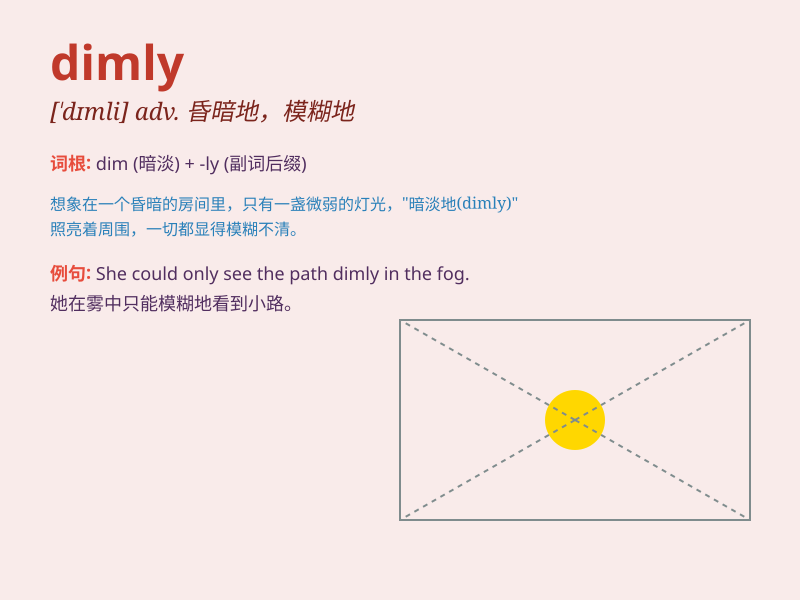

## dimly

**英音:** _[ˈdɪmli]_ **美音:** _[ˈdɪmli]_

**译义:** *adv.微暗,朦胧*

### 短语

+ **dimly lit:** _灯光昏暗的_

+ **dimly perceived:** _隐约感觉到的_

+ **dimly visible:** _隐约可见的_

+ **see dimly:** _看不清楚_

+ **shine dimly:** _暗淡地发光_

### 例句

#### 例句1

> **The room was dimly lit, making it difficult to see clearly.**

**中文翻译:** 这个房间灯光昏暗，使人难以看清。

**单词释义:** 昏暗地

#### 例句2

> **He could only dimly remember the events of that day.**

**中文翻译:** 他只能模糊地记得那天的事。

**单词释义:** 模糊地

#### 例句3

> **The figure in the distance was seen dimly through the fog.**

**中文翻译:** 透过雾，远处的身影模模糊糊地被看到。

**单词释义:** 朦胧地；隐约地

### 背诵小故事

> In a dark cave, a small lantern shone dimly. A lost adventurer
struggled to see the path ahead. The dim light made it hard for him to
move safely. He needed a brighter source to guide him out.

**在一个黑暗的洞穴里，一盏小灯笼昏暗地亮着。一位迷路的冒险家努力看清前方的路。昏暗的光线使他难以安全前行。他需要更亮的光源来引导他出去。**

### 图义

