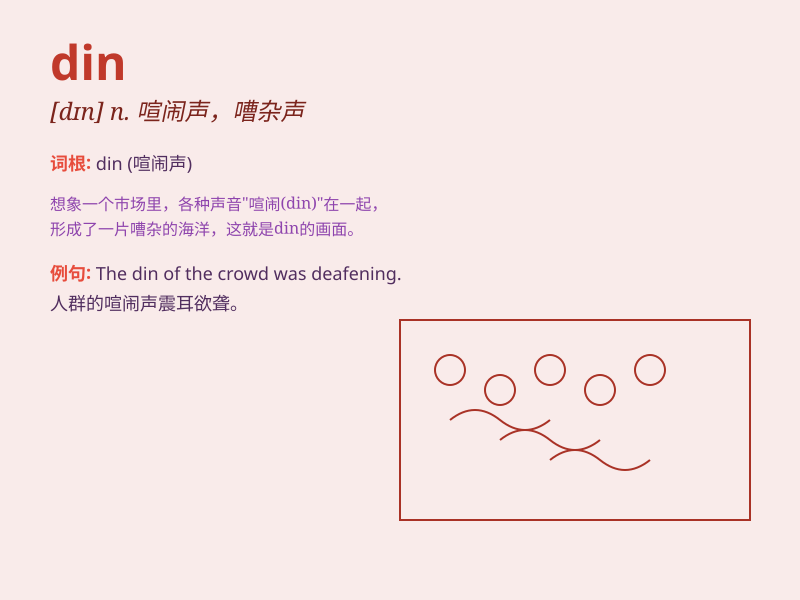

## din

**英音:** _[dɪn]_ **美音:** _[dɪn]_

**译义:** *n.喧嚣v.絮絮不休地说,喧闹*

### 短语

+ **din sth into sb:** _反复对某人说某事_

+ **din the noise in:** _把噪音灌入_

+ **din out:** _喧闹_

+ **din sth up:** _竭力鼓吹某事_

+ **make a din:** _发出喧闹声_

### 例句

#### 例句1

> **The din of the construction site was unbearable.**

**中文翻译:** 建筑工地的喧闹声让人无法忍受。

**单词释义:** 喧闹声；嘈杂声

#### 例句2

> **The din in the market made it hard to think.**

**中文翻译:** 市场里的嘈杂声让人难以思考。

**单词释义:** 喧闹；嘈杂

#### 例句3

> **The din of the party could be heard from far away.**

**中文翻译:** 从远处就能听到聚会的喧闹声。

**单词释义:** 吵闹声

### 背诵小故事

> In a noisy factory, machines were making a continuous DIN. Workers
had to shout to be heard. One day, a smart engineer fixed the problem
and the DIN stopped. Now they could work in peace.

**在一个嘈杂的工厂里，机器持续发出'din（喧嚣）'声。工人们得大声喊叫才能被听到。有一天，一位聪明的工程师解决了问题，喧嚣声停止了。现在他们能安静地工作了。**

### 图义

