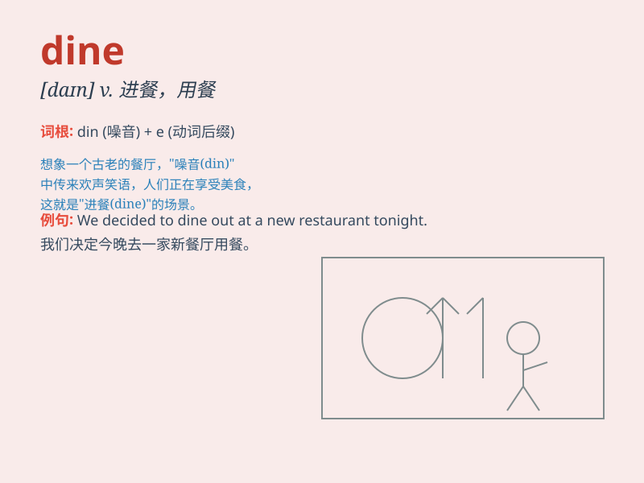

## dine

**英音:** _[daɪn]_ **美音:** _[daɪn]_

**译义:** *vi.吃饭,进餐*

### 短语

+ **dine out:** _外出就餐；下馆子_

+ **dine in:** _在家吃饭_

+ **dine with:** _与\...\...一起进餐_

+ **dine on:** _吃\...\..._

+ **dine alone:** _独自用餐_

### 例句

#### 例句1

> **We dined at a fancy restaurant last night.**

**中文翻译:** 昨晚我们在一家高档餐厅用餐。

**单词释义:** 用餐；吃饭

#### 例句2

> **The king dined with his advisers.**

**中文翻译:** 国王和他的顾问们一起进餐。

**单词释义:** 进餐

#### 例句3

> **They often dine outdoors in summer.**

**中文翻译:** 夏天他们经常在户外用餐。

**单词释义:** 用餐

### 背诵小故事

> One day, a hungry king was invited to dine in a grand palace. The
table was filled with delicious food. He enjoyed the meal and felt very
satisfied. Remember, \'dine\' means to have a meal, especially in a
formal or nice way.

**一天，一位饥饿的国王受邀在一座宏伟的宫殿里用餐。餐桌上摆满了美味的食物。他享受了这顿饭，感到非常满足。记住，'dine'意思是用餐，尤指正式或讲究地用餐。**

### 图义

