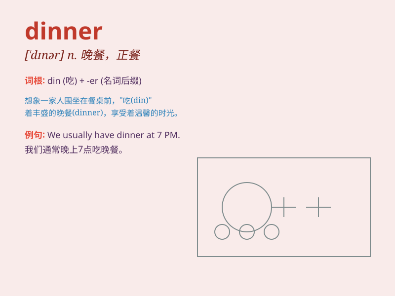

## dinner

**英音:** _[\'dɪnə]_ **美音:** _[\'dɪnɚ]_

**译义:** *n.正餐,宴会*

### 短语

+ **dinner party:** _宴会；晚餐会_

+ **dinner table:** _餐桌_

+ **cook dinner:** _做晚餐_

+ **have dinner:** _吃晚餐_

+ **dinner jacket:** _男子无尾礼服上装_

### 例句

#### 例句1

> **We had a delicious dinner at the new restaurant last night.**

**中文翻译:** 昨晚我们在新餐馆吃了一顿美味的晚餐。

**单词释义:** 晚餐

#### 例句2

> **What time is dinner served in this hotel?**

**中文翻译:** 这家酒店什么时候供应晚餐？

**单词释义:** 晚餐

#### 例句3

> **She cooked a special dinner for her parents\' anniversary.**

**中文翻译:** 她为父母的周年纪念日做了一顿特别的晚餐。

**单词释义:** 晚餐

### 背诵小故事

> One day, a hungry boy was looking forward to dinner. His mom cooked
delicious chicken and rice. When the clock struck six, they sat at the
table and enjoyed the meal together. Dinner made him happy and full.

**有一天，一个饥饿的男孩期待着晚餐。他的妈妈做了美味的鸡肉和米饭。当钟敲六点时，他们坐在桌前一起享用了这顿饭。晚餐让他开心又饱腹。**

### 图义

